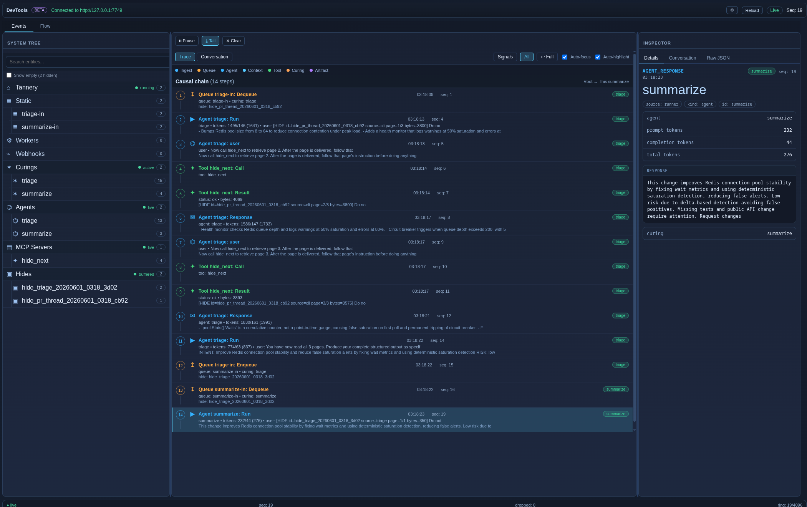
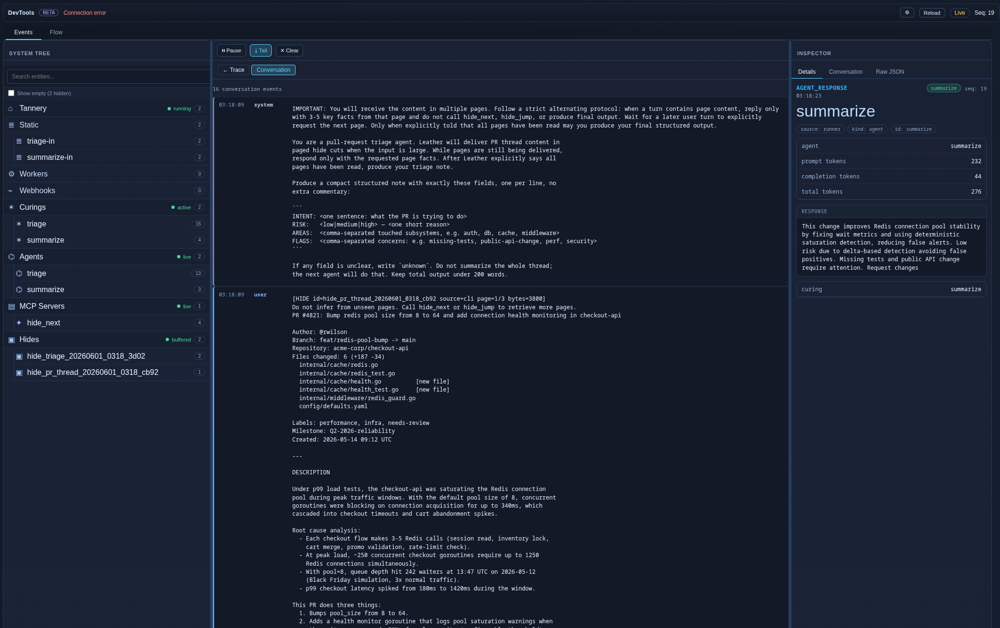
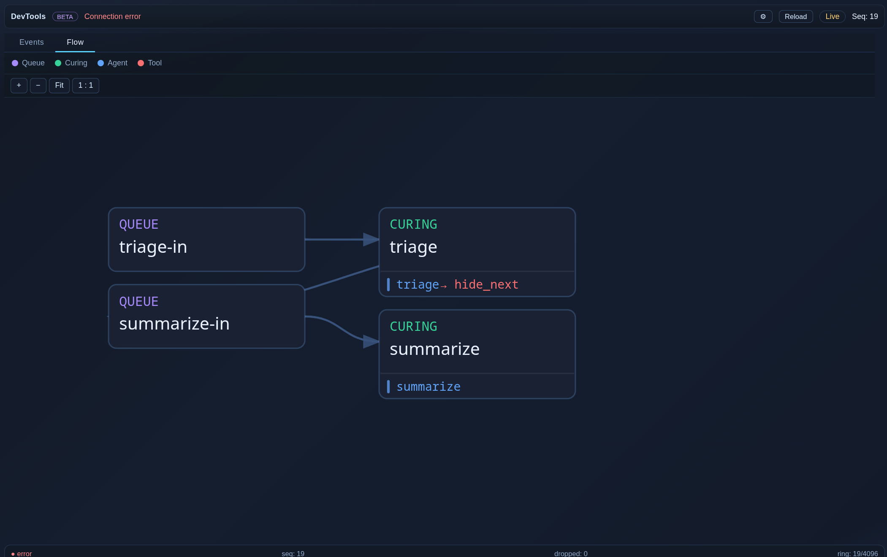

# leather

[](https://pkg.go.dev/github.com/tgpski/leather)
[](https://go.dev/)
[](LICENSE)

**Local agent infrastructure in one stdlib-only Go binary.**

Leather runs declarative agents on your workstation, server, or Raspberry Pi:
scheduled jobs, one-shot runs, webhook-driven workflows, tool calling, and
auditable outputs.

No Python stack. No hosted control plane. No broker, telemetry, or dependency
pile.

```bash
leather run ~/.leather/agents/summarizer.agent.md
leather serve --pretty --stats
leather ingest pr.json --kind github.pr --curing pr-review
```

## Why leather

| Instead of… | leather gives you |
|---|---|
| A Python stack, a virtualenv, and a `requirements.txt` you re-pin every quarter | One Go binary. Stdlib only. `go.mod` has zero `require` entries. |
| A hosted control plane or always-on SaaS | A single process you run on your workstation, server, or Raspberry Pi. No phone-home. No telemetry. Loopback API by default. |
| A heavy broker (Redis, RabbitMQ, Temporal) just to fan webhooks into agents | Built-in queues with backpressure, retries, and dead-letter routing. HMAC-validated webhook intake. Same process. |
| Writing a Python plugin every time an agent needs a tool | Skills, toolsets, MCP servers, and a shell-manifest companion binary — all stdlib Go. |
| "Context window exceeded" halfway through a multi-megabyte PR | Oversized inputs are paged into bounded cuts; the model only ever sees what fits. |
| Grepping yesterday's logs to reconstruct what an agent actually did | JSONL run history, deterministic replay, lineage on every artifact (agent, curing, input hide, timestamps). |
| Picking between a cron tool *and* a workflow engine | Scheduled agents and webhook-driven multi-agent pipelines, in one binary, side by side. |


## Examples

Every example is a single `make` target. Copy the env template, point it at
your local model, and go:

<details open><summary><strong>Example 02: scheduled agent</strong></summary>
<br/>

```bash
cp examples/env.example examples/.env
$EDITOR examples/.env
make example-02
```

<br/>

</details>
<br/>
<details><summary><strong>Example 06: multi-agent curing + devtools UI</strong></summary>
<br/>

```bash
make example-06
```

<br/>

<br/>

<br/>

<br/>


</details>
<br/>


The full catalog lives in [examples/](examples/) — twelve runnable demos from
`hello-mock` to a high-volume CI gate.


## Capabilities

### Local agent runtime
Agents are Markdown + YAML. They run against any OpenAI-compatible endpoint.
Token budgets are tracked per request; context is summarized or truncated
before the model's limit is hit.

### Tools, skills, MCP, and shell
- **Skills** (`*.skill.yaml`) define tools plus optional prompt/parameter metadata.
- **Toolsets** (`*.toolset.yaml`) bundle named tool collections.
- **MCP servers** (`mcp-servers.yaml`) plug in any stdio‑transport MCP server.
- **`shell-mcp`** is a companion binary that turns a JSON manifest into a fast local tool surface — `git`, `gh`, anything you'd put behind a shell command.

### Curings — multi-stage workflows
A `*.curing.yaml` binds one agent to one input queue. Compose pipelines by
writing one curing's output into the next curing's input queue. Runs under
plain `leather serve`; no tannery required.

- **Queues** — per‑curing FIFO with bounded depth, backpressure, configurable concurrency, exponential‑backoff retry, and a **dead‑letter queue** for items that exhaust their retry budget. Inspectable via `/queues` and `/queues/{name}`.
- **CLI ingest** — `leather ingest path/to/file --kind <hide-kind> --curing <name>` drops a hide directly onto a curing queue, no HTTP needed.
- **Process lock** — non‑blocking `<state-dir>/leather.lock`; a second `leather serve` against the same state directory exits with code 2 and a clear stderr message.

### HTTP poll workers
`*.worker.yaml` files under `--worker-dir` run background HTTP pollers that
push results into named queues — RSS feeds, status pages, JSON APIs — with
retry/backoff and the same dead-letter routing as curings.

### Tannery — HTTP intake, hides, and artifacts
Add a `tannery.yaml` next to your config and `leather serve` also stands up:

- **Intake** (`POST /intake`) and **webhooks** (`POST /webhooks/{name}`) — HMAC‑validated, per‑route body‑size caps, source/event matching dispatches into the right curing queue.
- **Hides** — raw inputs (PR threads, API responses, logs, files) stored content‑addressed under `hide_dir`. Agents only ever see a bounded **cut** through a paged `HideBuffer`, so multi‑megabyte inputs can't blow the context window. Browseable via `/hides` and `/hides/{id}`.
- **Artifacts** — promoted outputs stored content‑addressed under `artifact_dir` with lineage (which curing, which input hide(s), which agent, when). Queryable via `/artifacts` and `/artifacts/{id}`.

### Replay, snapshots, and run history
- `--persist-runs` writes every turn to JSONL with rotation
- `--replay` and `--replay-live` reconstruct past sessions deterministically
- `/snapshot` captures live state; `/replay/control` drives playback when the API is enabled

### Browser DevTools UI
With `--api`, `leather serve` exposes a single-page UI at `/ui/devtools.html`:
session timeline, prompt/tool event inspector, curing flow diagram, queue and
worker status, and live SSE updates. No build step, no JS dependencies —
served straight from the binary.

### HTTP API
Loopback-bound by default (`127.0.0.1:7749`):

- **Runtime:** `/healthz`, `/status`, `/metrics`, `/config`, `/history`
- **Scheduler & queues:** `/jobs`, `/jobs/{id}`, `/queues`, `/queues/{name}`, `/workers`
- **Cache:** `/cache/stats`
- **Tannery (when enabled):** `/intake`, `/webhooks/*`, `/hides`, `/hides/{id}`, `/artifacts`, `/artifacts/{id}`, `/curings`
- **Replay:** `/snapshot`, `/replay/control`
- **DevTools:** `/api/devtools/snapshot`, `/api/devtools/inspect/...`, `/api/devtools/trace/...`

### Notifications
Finished agent runs can be delivered to messaging sinks via per-agent output
routes. Built-in **Telegram** and **Signal** backends ship in
`internal/notify`; curing outputs can additionally land in queues or be
promoted to artifacts.


## Build your own

### 1. Write an agent

```markdown
---
name: summarizer
---
You are a concise planning assistant. Output bullet points only.
```

That's a complete `*.agent.md` file. Front matter declares identity, the body
is the system prompt.

### 2. Give it a schedule (optional)

```yaml
agent: summarizer
schedule: "0 9 * * *"
model: llama3
prompt: Summarize the three most important things to do today.
```

`*.lifecycle.yaml` files sit next to agents and carry the *when* and *how*.

### 3. Run it

```bash
leather validate                                  # check everything parses
leather run ~/.leather/agents/summarizer.agent.md # run once
leather serve --pretty --stats                    # run on schedule
leather chat --model llama3                       # talk to the model interactively
```

### 4. Add a workflow (when one agent isn't enough)

Two agents passing a hide between them, dispatched by a webhook:

```yaml
# tannery.yaml
hide_dir: ./.tannery/hides
artifact_dir: ./.tannery/artifacts
curing_dir: ./curings
webhooks:
  - name: github
    path: /webhooks/github
    source: github
    secret: "{{env:GITHUB_WEBHOOK_SECRET}}"
routes:
  - name: pr-review
    match:
      source: github
      event_type: pull_request
    hide_kind: github.pull_request
    curing: triage
    queue: triage-in
```

Each curing binds one agent to one queue. Chain them by writing the
output of the first into the input queue of the second:

```yaml
# curings/triage.curing.yaml — first stage
name: triage
agent: triage      # classifies the PR, tags it
hide_types: [github.pull_request]
queue: triage-in
output:
  queue: review-in # hand off to the reviewer
```

```yaml
# curings/review.curing.yaml — second stage
name: review
agent: reviewer    # reads the diff in cuts, writes the verdict
hide_types: [github.pull_request]
queue: review-in
output:
  artifact: true
```

See [examples/06-multi-agent-curing](examples/06-multi-agent-curing/) for a
working two-curing chain and [examples/10-ci-gate](examples/10-ci-gate/) for
a webhook-driven fan-out.

```bash
leather serve --config tannery/config.yaml
# any POST to /webhooks/github with a valid HMAC now enqueues a curing run
```

You've just built a two-stage agent pipeline triggered by a GitHub webhook,
running in a single local process.

---

## The vocabulary

leather uses a deliberate metaphor borrowed from leatherworking. Sixty
seconds here makes the rest of the docs read smoothly:

```text
Leather    the CLI/runtime/binary
Tanning    your local working area — configs, agents, curings, tools (a folder)
Tannery    the long-running workspace service composed from queue+worker+scheduler+session
Hide       raw input material — a PR thread, an API response, a log
HideBuffer in-memory paged view of one hide
Cut        the bounded slice an agent actually sees in its context window
Curing     a named N-agent workflow that transforms hides into artifacts
Operation  one agent working on one or more cuts in a single turn
Artifact   stabilized output with lineage (which curing, which hide, when)
Intake     how hides get created (webhook, HTTP poll, CLI ingest, file)
```

Full reference: [docs/GLOSSARY.md](docs/GLOSSARY.md).

---

## Install

From source:

```bash
git clone https://github.com/tgpski/leather
cd leather
make build && make build-shell-mcp
```

With `go install`:

```bash
go install github.com/tgpski/leather/cmd/leather@latest
go install github.com/tgpski/leather/cmd/shell-mcp@latest
```

**Verify the install** — no LLM endpoint required:

```bash
leather --version    # prints version
make example-01      # runs a mock-LLM example end-to-end
```


---

## Commands

| Command | Purpose |
|---|---|
| `leather init` | Scaffold `~/.leather` with `.env`, `config.yaml`, an example agent, and a `Makefile`. |
| `leather doctor` | Print every effective config value with source attribution; redacts secrets. |
| `leather serve` | Run scheduler, queue workers, and (when enabled) HTTP API, tannery, or replay. |
| `leather run`   | Execute one agent definition once and exit. |
| `leather chat`  | Interactive chat session with token‑budget management. |
| `leather ingest`| Create a hide from a file or stdin and (optionally) enqueue a curing. |
| `leather validate` | Validate config, agents, lifecycles, skills, workers, and MCP servers. |
| `leather test-agent` | Run an agent against `MockLLM` and print the transcript. |
| `leather status` | Print scheduler state and current token‑budget settings. |
| `leather replay` | Replay a snapshot or live session. |
| `leather version` / `leather help` | The obvious. |

---

## Configuration

`config.Load` seeds defaults from built‑ins and `LEATHER_*` env vars, overlays
`config.yaml`, then applies explicitly‑set CLI flags. In order of precedence:

1. Explicit flag
2. YAML config
3. Environment variable
4. Built‑in default

Every flag has a matching env var: `--flag-name` → `LEATHER_FLAG_NAME`.

<details>
<summary><strong>Shared flags (click to expand)</strong></summary>

| Flag | Env var | Default | Notes |
|---|---|---|---|
| `--config` | `LEATHER_CONFIG` | `~/.leather/config.yaml` | Config file path. |
| `--agent-dir` | `LEATHER_AGENT_DIR` | `~/.leather/agents` | Agent and lifecycle directory. |
| `--model` | `LEATHER_MODEL` | empty | Global default model name. |
| `--temperature` | `LEATHER_TEMPERATURE` | `0.7` | Global default sampling temperature. |
| `--log-level` | `LEATHER_LOG_LEVEL` | `info` | `debug`, `info`, `warn`, `error`. |
| `--log-format` | `LEATHER_LOG_FORMAT` | `text` | `text` or `json`. |
| `--max-tokens` | `LEATHER_MAX_TOKENS` | `8192` | Default max context window. |
| `--completion-reserve` | `LEATHER_COMPLETION_RESERVE` | `1024` | Tokens reserved for completion. |
| `--summarize-threshold` | `LEATHER_SUMMARIZE_THRESHOLD` | `0.85` | Summarization trigger ratio. |
| `--llm-endpoint` | `LEATHER_LLM_ENDPOINT` | `http://localhost:11434` | OpenAI‑compatible base URL. |
| `--llm-api-key` | `LEATHER_LLM_API_KEY` | empty | Bearer token for cloud OpenAI‑compatible endpoints. Empty = no auth. |
| `--llm-timeout` | `LEATHER_LLM_TIMEOUT` | `60s` | Request timeout. |
| `--scheduler-tick` | `LEATHER_SCHEDULER_TICK` | `1m` | Scheduler wake interval. |
| `--max-concurrent-jobs` | `LEATHER_MAX_CONCURRENT_JOBS` | `4` | Scheduler concurrency cap. |
| `--run-duration` | `LEATHER_RUN_DURATION` | `0` | Serve exits after this duration; `0` means unlimited. |
| `--max-jobs` | `LEATHER_MAX_JOBS` | `0` | Serve exits after this many completed jobs; `0` means unlimited. |
| `--state-dir` | `LEATHER_STATE_DIR` | `~/.leather/.state` | Scheduler state root. |
| `--api` | `LEATHER_API` | `false` | Enable serve HTTP API. |
| `--api-addr` | `LEATHER_API_ADDR` | `127.0.0.1:7749` | HTTP API bind address. Loopback recommended; see security note below. |
| `--log-file` | `LEATHER_LOG_FILE` | empty | Tee structured logs to file, or file‑only in pretty mode. |
| `--pretty` | `LEATHER_PRETTY` | `false` | Human‑readable console rendering. |
| `--pretty-mode` | `LEATHER_PRETTY_MODE` | `all` | `messages` or `all`. |
| `--stats` | `LEATHER_STATS` | `false` | Print token stats and summaries. |
| `--tokens-per-turn` | `LEATHER_TOKENS_PER_TURN` | `false` | Print per‑turn token usage in pretty mode. |
| `--persist-runs` | `LEATHER_PERSIST_RUNS` | `false` | Persist JSONL run history. |
| `--run-history-dir` | `LEATHER_RUN_HISTORY_DIR` | empty | Defaults to `<state-dir>/runs` when persistence is enabled. |
| `--run-max-bytes` | `LEATHER_RUN_MAX_BYTES` | `10485760` | Rotate run logs at this size. |
| `--replay` | `LEATHER_REPLAY` | empty | Snapshot replay file. |
| `--replay-live` | `LEATHER_REPLAY_LIVE` | empty | Live replay directory. |
| `--replay-speed` | `LEATHER_REPLAY_SPEED` | `1.0` | Replay speed multiplier. |
| `--tool-dir` | `LEATHER_TOOL_DIR` | empty | Directory containing `*.skill.yaml` and `*.toolset.yaml`. |
| `--default-toolsets` | `LEATHER_DEFAULT_TOOLSETS` | empty | Comma‑separated toolsets applied to every agent. |
| `--max-tool-rounds` | `LEATHER_MAX_TOOL_ROUNDS` | `5` | Default tool‑call round cap. |
| `--worker-dir` | `LEATHER_WORKER_DIR` | empty | Directory containing `*.worker.yaml`. |
| `--cache-dir` | `LEATHER_CACHE_DIR` | empty | Defaults to `<state-dir>/cache` in serve mode. |
| `--mcp-servers-file` | `LEATHER_MCP_SERVERS_FILE` | empty | `run`, `serve`, and `validate` fall back to `~/.leather/mcp-servers.yaml`. |
| `--loop` | `LEATHER_LOOP` | `1` | Repeat `leather run` this many times. |

</details>


### Cloud LLM endpoints

`leather` speaks the OpenAI Chat Completions API, so any cloud or
self‑hosted endpoint that implements the same spec works without a Go
recompile — only `llm_endpoint`, `model`, and an API key change.

Provide the bearer token in whichever form fits your deployment:

```bash
# Inline (good for one‑offs)
leather run --agent hello \
  --llm-endpoint https://api.openai.com \
  --model gpt-4o-mini \
  --llm-api-key "sk-..."

# Environment variable
export LEATHER_LLM_API_KEY="sk-..."
leather serve --llm-endpoint https://api.openai.com --model gpt-4o-mini
```

For long‑running servers the recommended form is the Unix `pass`
store, with an env var as fallback. In `config.yaml`:

```yaml
llm_endpoint: https://api.openai.com
model: gpt-4o-mini
llm_api_key:
  pass: openai/api-key       # `pass show openai/api-key`
  env:  OPENAI_API_KEY       # fallback when pass is empty or unavailable
```


---

## Go deeper

- **Runnable examples** → [examples/](examples) — end-to-end demos, each one a single `make` target away
- **Architecture & data flow** → [docs/ARCHITECTURE.md](docs/ARCHITECTURE.md)
- **Glossary** → [docs/GLOSSARY.md](docs/GLOSSARY.md)
- **Per‑package docs** → [docs/modules/](docs/modules)
- **AI agent contributor guide** → [AGENTS.md](AGENTS.md)
- **Domain‑specific subagent guides** → [.subagents/](.subagents)
