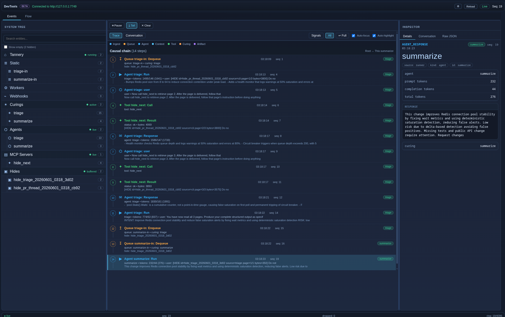

# leather

[releases](https://github.com/TGPSKI/leather/releases) | [changelog](CHANGELOG.md) | [pkg.go.dev](https://pkg.go.dev/github.com/tgpski/leather) | [leather.sh](https://leather.sh) | [pate.sh](https://pate.sh)

**Local agent infrastructure in one stdlib-only Go binary.** 

Leather runs declarative agents on your workstation, server, or Raspberry Pi: scheduled jobs, one-shot runs, webhook-driven workflows, tool calling, and auditable outputs.

No Python stack. No hosted control plane. No broker, telemetry, or dependency pile.

```bash
cat > summarizer.agent.md <<'EOF'
---
name: summarizer
---
You are a concise planning assistant. Output bullet points only.
EOF

leather validate --agent-dir .
leather run summarizer.agent.md
```

## See it run

Sixteen demos in [examples/](examples/), each one `make` target away.

<details open><summary><strong>Example 02: scheduled agent</strong></summary>
<br/>

```bash
cp examples/env.example examples/.env
$EDITOR examples/.env
make example-02
```

<br/>

</details>
<br/>
<details><summary><strong>Example 06: multi-agent curing + devtools UI</strong></summary>
<br/>

```bash
make example-06
```

<br/>

<br/>

</details>
<br/>

Same code path also runs a profiled 100-webhook burst — 500 LLM calls,
965K tokens, five fan-out/fan-in stages — end to end in 190s at 6.5% avg
host CPU and no measurable IO pressure. Leather isn't the bottleneck; the
model is. Full profile in
[examples/11-high-volume-ci](examples/11-high-volume-ci/#measured-at-scale-100-webhook-full-system-profile).

## What it does

| | |
|---|---|
| **Agents** | `*.agent.md` — Markdown front and a system prompt with 0-N turns and variable support.|
| **Tools** | Skills, toolsets, MCP server support, and [`shell-mcp`](examples/03-shell-skill/) (`make build-shell-mcp`) for turning shell commands into agent tools. |
| **Curings** | Bind agents to queues for flexible multi-stage routing. |
| **Queues** | Filesystem FIFO — configurable depth, backpressure, concurrency, dead-letter routing, and single-use parameterized queues. |
| **Workers** | Goroutines with hooks into queues. |
| **Tannery** | Pipelines connecting agents, curings, workers, and artifacts, with fan-in / fan-out routing. |
| **DevTools** | Stdlib-JS UI with session timeline, event inspector, curing flow diagram, and live SSE. |
| **Notifications** | Telegram and Signal backends. |

## Build one

A complete agent:

```markdown
---
name: summarizer
---
You are a concise planning assistant. Output bullet points only.
```

A schedule for it (`*.lifecycle.yaml`, optional):

```yaml
agent: summarizer
schedule: "0 9 * * *"
model: llama3
prompt: Summarize the three most important things to do today.
```

Run it:

```bash
leather validate                                  # check everything parses
leather run ~/.leather/agents/summarizer.agent.md # run once
leather serve --pretty --stats                    # run on schedule
```

Chaining two agents behind a webhook — one triages, one reviews, an artifact
comes out the other end — is the same primitives composed: see the
[GUIDE.md: two-agent pipeline recipe](docs/GUIDE.md#recipe-two-agent-pipeline) and
[examples/06-multi-agent-curing](examples/06-multi-agent-curing/).

## Install

From source:

```bash
git clone https://github.com/tgpski/leather
cd leather
make build && make build-shell-mcp
make install
```

With `go install`:

```bash
go install github.com/tgpski/leather/cmd/leather@latest
go install github.com/tgpski/leather/cmd/shell-mcp@latest
```

**Verify the install** — no LLM endpoint required:

```bash
leather --version    # prints version
make example-01      # runs a mock-LLM example end-to-end
```
## Model and endpoint

Every command above needs a model and an LLM endpoint from somewhere. All
three forms set the same values — flag wins over env var, env var wins over
`config.yaml`:

```bash
# flag
leather run agent.md --model llama3 --llm-endpoint http://localhost:11434
```

```bash
# env var
export LEATHER_MODEL=llama3
export LEATHER_LLM_ENDPOINT=http://localhost:11434
```

```yaml
# config.yaml
model: llama3
llm_endpoint: http://localhost:11434
```

`leather` speaks the OpenAI Chat Completions API, so cloud endpoints work the
same way. The bearer token resolves inline value → `pass` → env var, in that
order:

```bash
export LEATHER_LLM_API_KEY="sk-..."
leather serve --llm-endpoint https://api.openai.com --model gpt-4o-mini
```

```yaml
# config.yaml + unix pass
llm_endpoint: https://api.openai.com
model: gpt-4o-mini
llm_api_key:
  pass: openai/api-key       # `pass show openai/api-key`
  env:  OPENAI_API_KEY       # fallback when pass is empty or unavailable
```

## Go deeper

- **Implementation guide** → [docs/GUIDE.md](docs/GUIDE.md) — every file format plus recipes for each pattern above
- **Architecture & data flow** → [docs/ARCHITECTURE.md](docs/ARCHITECTURE.md)
- **Glossary** → [docs/GLOSSARY.md](docs/GLOSSARY.md)
- **Per-package docs** → [docs/modules/](docs/modules)
- **Agent contributor guide** → [AGENTS.md](AGENTS.md)
- **Domain-specific subagent guides** → [.subagents/](.subagents)
