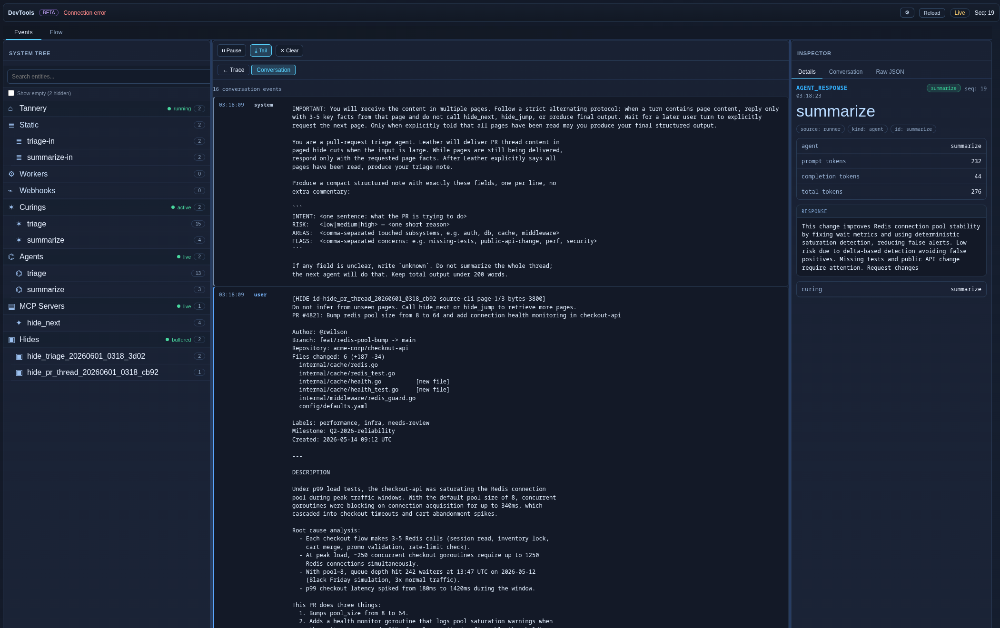
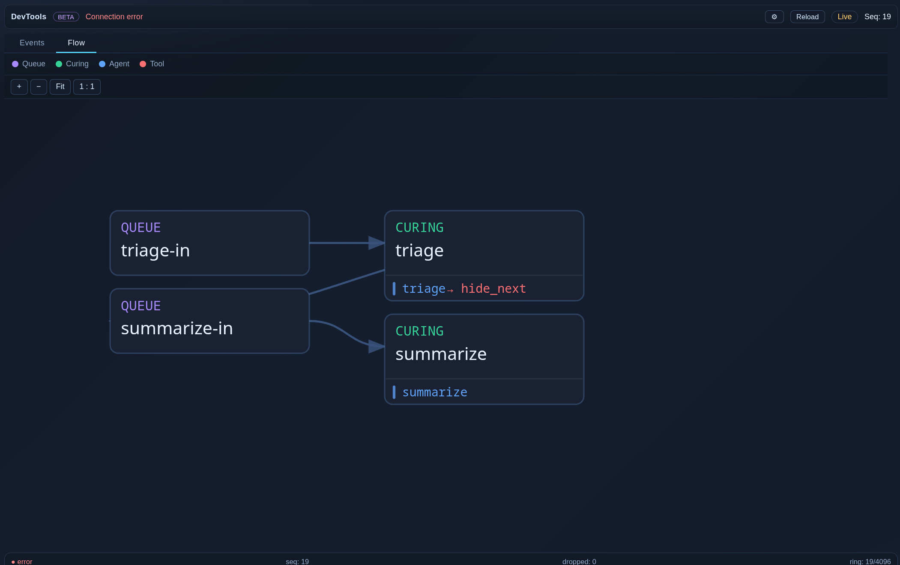

# leather

[pkg.go.dev](https://pkg.go.dev/github.com/tgpski/leather) | [releases](https://github.com/TGPSKI/leather/releases) | [leather.sh](https://leather.sh) | [pate.sh](https://pate.sh)

**Local agent infrastructure in one stdlib-only Go binary.**

Leather runs declarative agents on your workstation, server, or Raspberry Pi:
scheduled jobs, one-shot runs, webhook-driven workflows, tool calling, and
auditable outputs.

No Python stack. No hosted control plane. No broker, telemetry, or dependency
pile.

```bash
leather run ~/.leather/agents/summarizer.agent.md
leather serve --pretty --stats
leather ingest pr.json --kind github.pr --curing pr-review
```

## Examples

Every example runnable via make - thirteen primary demos and
three Raspberry Pi / Hailo examples in [examples/](examples/).

<details open><summary><strong>Example 02: scheduled agent</strong></summary>
<br/>

```bash
cp examples/env.example examples/.env
$EDITOR examples/.env
make example-02
```

<br/>

</details>
<br/>
<details><summary><strong>Example 06: multi-agent curing + devtools UI</strong></summary>
<br/>

```bash
make example-06
```

<br/>

<br/>

<br/>

<br/>


</details>
<br/>


## Capabilities

### Local agent runtime
Agents are Markdown + YAML. They run against any OpenAI-compatible endpoint.

### Tools, skills, MCP, and shell
- **Skills** (`*.skill.yaml`) define tools plus optional prompt/parameter metadata.
- **Toolsets** (`*.toolset.yaml`) bundle named tool collections.
- **MCP servers** (`mcp-servers.yaml`) plug in any stdio‑transport MCP server.
- **`shell-mcp`** is a companion binary that turns a JSON manifest into a fast local tool surface — `git`, `gh`, anything you'd put behind a shell command.

### Curings — multi-stage workflows
A `*.curing.yaml` binds one agent to one input queue. Compose pipelines by
writing one curing's output into the next curing's input queue. Runs under
plain `leather serve`; no tannery required.

- **Queues** — per‑curing FIFO with bounded depth, backpressure, configurable concurrency, exponential‑backoff retry, and a dead‑letter queue for items that exhaust their retry budget. Inspectable via `/queues` and `/queues/{name}`.
- **CLI ingest** — `leather ingest path/to/file --kind <hide-kind> --curing <name>` drops a hide directly onto a curing queue, no HTTP needed.
- **Process lock** — non‑blocking `<state-dir>/leather.lock`; a second `leather serve` against the same state directory exits with code 2 and a clear stderr message.

### HTTP poll workers
`*.worker.yaml` files under `--worker-dir` run background HTTP pollers that
push results into named queues — RSS feeds, status pages, JSON APIs — with
retry/backoff and the same dead-letter routing as curings.

### Tannery — HTTP intake, hides, and artifacts
Add a `tannery.yaml` next to your config and `leather serve` also stands up:

- **Intake** (`POST /intake`) and **webhooks** (`POST /webhooks/{name}`) — HMAC‑validated, per‑route body‑size caps, source/event matching dispatches into the right curing queue.
- **Hides** — raw inputs (PR threads, API responses, logs, files) stored content‑addressed under `hide_dir`. Agents only ever see a bounded **cut** through a paged `HideBuffer`, so multi‑megabyte inputs can't blow the context window. Browseable via `/hides` and `/hides/{id}`.
- **Artifacts** — promoted outputs stored content‑addressed under `artifact_dir` with lineage (which curing, which input hide(s), which agent, when). Queryable via `/artifacts` and `/artifacts/{id}`.

### Replay, snapshots, and run history
- `--persist-runs` writes every turn to JSONL with rotation

### Browser DevTools UI
With `--api`, `leather serve` exposes a single-page UI at `/ui/devtools.html`:
session timeline, prompt/tool event inspector, curing flow diagram, queue and
worker status, and live SSE updates. No build step, no JS dependencies —
served straight from the binary.

### Notifications
Finished agent runs can be delivered to messaging sinks via per-agent output
routes. Built-in **Telegram** and **Signal** backends ship in
`internal/notify`; curing outputs can additionally land in queues or be
promoted to artifacts.

## Build your own

### 1. Write an agent

```markdown
---
name: summarizer
---
You are a concise planning assistant. Output bullet points only.
```

That's a complete `*.agent.md` file. Front matter declares identity, the body
is the system prompt.

### 2. Give it a schedule (optional)

```yaml
agent: summarizer
schedule: "0 9 * * *"
model: llama3
prompt: Summarize the three most important things to do today.
```

`*.lifecycle.yaml` files sit next to agents and carry the *when* and *how*.

### 3. Run it

```bash
leather validate                                  # check everything parses
leather run ~/.leather/agents/summarizer.agent.md # run once
leather serve --pretty --stats                    # run on schedule
```

### 4. Add a workflow (when one agent isn't enough)

Two agents passing a hide between them, dispatched by a webhook:

```yaml
# tannery.yaml
hide_dir: ./.tannery/hides
artifact_dir: ./.tannery/artifacts
curing_dir: ./curings
webhooks:
  - name: github
    path: /webhooks/github
    source: github
    secret: "{{env:GITHUB_WEBHOOK_SECRET}}"
routes:
  - name: pr-review
    match:
      source: github
      event_type: pull_request
    hide_kind: github.pull_request
    curing: triage
    queue: triage-in
```

Each curing binds one agent to one queue. Chain them by writing the
output of the first into the input queue of the second:

```yaml
# curings/triage.curing.yaml — first stage
name: triage
agent: triage      # classifies the PR, tags it
hide_types: [github.pull_request]
queue: triage-in
output:
  queue: review-in # hand off to the reviewer
```

```yaml
# curings/review.curing.yaml — second stage
name: review
agent: reviewer    # reads the diff in cuts, writes the verdict
hide_types: [github.pull_request]
queue: review-in
output:
  artifact: true
```

See [examples/06-multi-agent-curing](examples/06-multi-agent-curing/) for a
working two-curing chain and [examples/10-ci-gate](examples/10-ci-gate/) for
a webhook-driven fan-out.

```bash
leather serve --config tannery/config.yaml
# any POST to /webhooks/github with a valid HMAC now enqueues a curing run
```

You've just built a two-stage agent pipeline triggered by a GitHub webhook,
running in a single local process.


## Install

From source:

```bash
git clone https://github.com/tgpski/leather
cd leather
make build && make build-shell-mcp
make install
```

With `go install`:

```bash
go install github.com/tgpski/leather/cmd/leather@latest
go install github.com/tgpski/leather/cmd/shell-mcp@latest
```

**Verify the install** — no LLM endpoint required:

```bash
leather --version    # prints version
make example-01      # runs a mock-LLM example end-to-end
```

---

### Cloud LLM endpoints

`leather` speaks the OpenAI Chat Completions API. Provide the bearer token in whichever form fits your deployment:

```bash
export LEATHER_LLM_API_KEY="sk-..."
leather serve --llm-endpoint https://api.openai.com --model gpt-4o-mini
```

```yaml
# config.yaml + unix pass

llm_endpoint: https://api.openai.com
model: gpt-4o-mini
llm_api_key:
  pass: openai/api-key       # `pass show openai/api-key`
  env:  OPENAI_API_KEY       # fallback when pass is empty or unavailable
```

---

## Go deeper

- **Runnable examples** → [examples/](examples) — end-to-end demos, each one a single `make` target away
- **Architecture & data flow** → [docs/ARCHITECTURE.md](docs/ARCHITECTURE.md)
- **Glossary** → [docs/GLOSSARY.md](docs/GLOSSARY.md)
- **Per‑package docs** → [docs/modules/](docs/modules)
- **AI agent contributor guide** → [AGENTS.md](AGENTS.md)
- **Domain‑specific subagent guides** → [.subagents/](.subagents)
