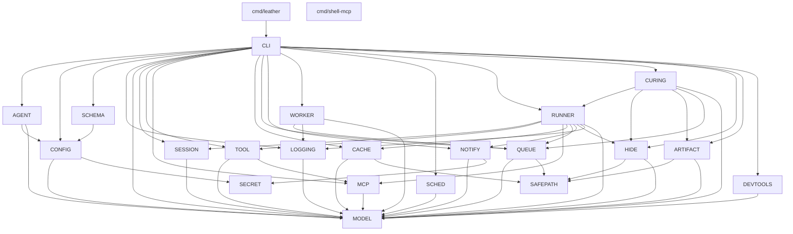
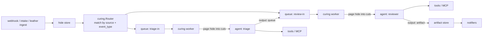
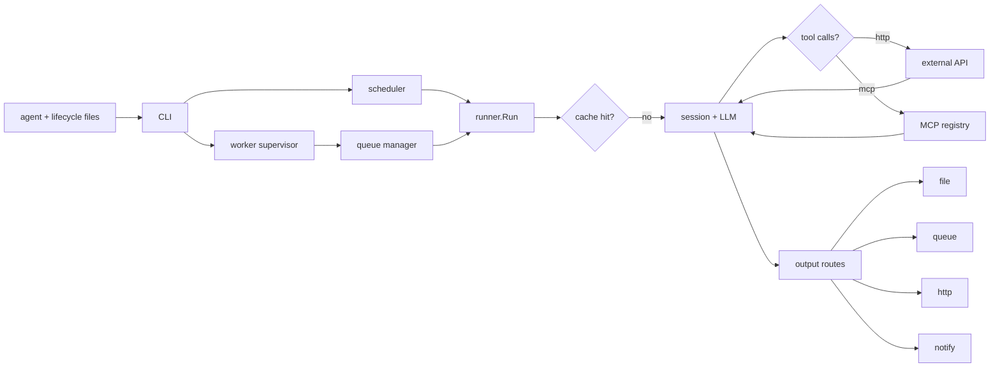

# Architecture

See [README.md](../README.md) for what leather is and how to invoke it. This
document covers package layout, data flow, and cross-cutting design notes.

Detailed per-package documentation lives in [docs/modules/](modules/).

## Package Layout

| Component | Path | Responsibility |
|---|---|---|
| `leather` entrypoint | `cmd/leather/` | Thin process entrypoint that delegates to `internal/cli`. |
| `shell-mcp` entrypoint | `cmd/shell-mcp/` | Companion stdio MCP server for local shell tools. |
| `model` | `internal/model/` | Shared domain types and enums used across packages. |
| `logging` | `internal/logging/` | Structured logging helpers and per-component levels. |
| `config` | `internal/config/` | Shared flag registration, env/YAML merging, path defaults. |
| `schema` | `internal/schema/` | Flat-schema validation for config, agents, skills, workers, and MCP servers. |
| `agent` | `internal/agent/` | `*.agent.md` and `*.lifecycle.yaml` parsing and validation. |
| `session` | `internal/session/` | Token budgets, session windows, summarization, LLM client interfaces. |
| `tool` | `internal/tool/` | Skill and toolset registry plus HTTP/MCP tool execution. |
| `mcp` | `internal/mcp/` | MCP server config loading, stdio JSON-RPC clients, registry lifecycle. |
| `cache` | `internal/cache/` | File-backed agent response cache. |
| `queue` | `internal/queue/` | JSONL FIFO queues and named queue manager. |
| `notify` | `internal/notify/` | Telegram and Signal backends plus secret resolution. |
| `worker` | `internal/worker/` | Declarative polling workers that enqueue items. |
| `scheduler` | `internal/scheduler/` | Cron parsing, job dispatch, state persistence, concurrency control. |
| `runner` | `internal/runner/` | Multi-turn runtime loop, prompt expansion, output routing, progress events. |
| `hide` | `internal/hide/` | Persistent raw input store ("hides") plus in-memory paginated buffer for oversized tool output. Hides are flock'd and content-addressed. |
| `curing` | `internal/curing/` | Curing worker, supervisor, router, loader. A curing binds one agent to one queue and produces cuts from hides, an artifact, or hands off to the next queue. |
| `artifact` | `internal/artifact/` | Stabilized curing output with lineage and content-addressed IDs. |
| `safepath` | `internal/safepath/` | Anchor-relative path validation. Rejects absolute paths and traversal (`..`) outside a configured root. Used by every store (hide, artifact, queue, cache, tool `OutputFile`). |
| `secret` | `internal/secret/` | Resolves `{{env:VAR}}` and other secret references at config load time. Used by `notify` backends and webhook secrets. |
| `devtools` | `internal/devtools/` | DevTools UI support: in-process event bus (`bus`), causality tracing (`causality`), source aggregators (`sources`). Powers `/api/devtools/*` endpoints. |
| `cli` | `internal/cli/` | Subcommand handlers, serve wiring, replay modes, HTTP API, tannery HTTP endpoints. |

## Dependency Graph

`internal/model` is the foundation: it has no internal imports. `config` and
`mcp` are low-level utility packages. `runner` sits on top of the session,
tooling, cache, queue, and notify layers. `cli` composes the whole runtime.

## Tannery Pipeline

The tannery is the event-driven side of `leather serve`. A webhook or `leather
ingest` call writes a **hide** (raw input), the router maps it to one or more
**curings**, a queue worker pages the hide into cuts, runs the bound agent,
and produces either an **artifact** or a hand-off to the next queue.

Fan-out is per-route: one webhook event may match multiple routes, each
getting its own isolated per-event queue via `queue_pattern` (e.g.
`pr-meta-{{correlation_id}}`). Fan-in is via `collect_size` on a downstream
curing that waits for N inputs sharing a correlation ID before running.

## CLI Surface

| Command | Handler | Notes |
|---|---|---|
| `serve` | `RunServe` | Normal scheduler mode, replay mode, or live replay mode depending on flags. |
| `chat` | `RunChat` | Interactive session with reset/show/stats/dev commands. |
| `run` | `RunOnce` | Positional single-agent execution with optional lifecycle auto-merge. |
| `validate` | `RunValidate` | Schema and semantic validation across config and definition files. |
| `test-agent` | `RunTestAgent` | MockLLM-based agent harness with canned tool responses. |
| `status` | `RunStatus` | Human-readable state summary against a running `serve` instance. |
| `ingest` | `RunIngest` | Read bytes (file or stdin) and write a hide; optionally enqueue for an existing curing. |
| `replay` | `RunReplay` | Replay a captured snapshot file or live `runs/` directory through the API. Wraps `serve --api --replay` / `--replay-live`. |
| `version` | `RunVersion` | Build metadata. Top-level `--version` / `-v` is the same. |
| `help` | `Run` built-in | Usage summary plus per-command help via standard flags. |

## Key Domain Types

| Type | Role |
|---|---|
| `model.Agent` | Full agent definition, including prompts, tool exposure, parameters, cache, queue, output, and hooks. |
| `model.Config` | Fully merged runtime configuration, including replay, persistence, tool, worker, cache, and MCP settings. |
| `model.ToolDefinition` | Executable tool descriptor with HTTP or MCP backend configuration. |
| `model.MCPToolConfig` | MCP server name and remote tool name for `mcp` tools. |
| `model.MCPServerConfig` | One `mcp-servers.yaml` record. |
| `model.Skill` | Prompt append plus tool and parameter bundle. |
| `model.Toolset` | Ordered named tool bundle used for policy/exposure. |
| `model.TokenBudget` | Max tokens, reserve, and summarize threshold. |
| `model.RunRecord` | Persisted/served run result with history, timing, and token totals. |
| `model.RunTime` | Start timestamp and duration for a run. |
| `model.RunTokens` | Prompt, response, and total token counts. |
| `model.Turn` | One prompt/response pair within a run record. |
| `model.ToolResult` | Tool output content plus optional `Error` string. |
| `model.WorkerDefinition` | HTTP poll worker configuration. |
| `model.QueueItem` | Queue payload consumed by agents or produced by workers. |

## Execution Pipeline

## Serve API

The API is unauthenticated by default and binds to loopback only. Set
`api.bind` (or `--api-bind`) to a non-loopback address only behind a reverse
proxy or VPN. The DevTools surface uses a separate per-launch token.

For operational detail (degraded-state JSON shape, troubleshooting, reverse
proxy guidance), see [OPERATIONS.md § Endpoints](OPERATIONS.md).

### Core endpoints

| Path | Purpose |
|---|---|
| `/healthz` | Liveness + state-dir writability + LLM endpoint configured. Returns 503 + JSON when degraded. |
| `/status` | Aggregate scheduler / worker / queue state for `leather status`. |
| `/config` | Effective runtime config (secrets redacted). |
| `/metrics` | Prometheus text format. |
| `/jobs`, `/jobs/{name}` | Scheduled-job inventory and per-job last run. |
| `/history` | Persisted run records. |
| `/snapshot` | Point-in-time scheduler/worker/queue snapshot. |

### Tannery endpoints

| Path | Purpose |
|---|---|
| `POST /intake` | Webhook intake; writes a hide and routes to matching curings. |
| `GET /hides`, `GET /hides/{id}` | List and inspect persisted hides. |
| `GET /artifacts`, `GET /artifacts/{id}` | List and inspect curing artifacts with lineage. |
| `GET /curings` | Loaded curing inventory. |
| `GET /queues/{name}`, `GET /queues/{name}-dlq` | Queue contents. |
| `POST /queues/{name}/requeue` | Move DLQ items back to the live queue (HTTP 207 on partial failure). |

### DevTools endpoints

Gated by Bearer auth using the per-launch token at `<state-dir>/devtools.token`
(mode `0600`).

| Path | Purpose |
|---|---|
| `GET /devtools` | Static UI bundle. |
| `GET /api/devtools/snapshot` | Aggregate state snapshot. |
| `GET /api/devtools/inspect/{kind}/{id}` | Inspect a specific entity (run, hide, artifact, queue, etc.). |
| `GET /api/devtools/trace/{id}` | Causality trace for one correlation ID. |
| `GET /api/devtools/events` | Server-Sent Events stream of live activity. |

### Replay-live

`leather replay --live` adds `/replay/control` for pause/resume and playback
speed.

## Design Constraints

- Stdlib only. `go.mod` intentionally has no `require` entries.
- Fail closed. Invalid config, agent files, lifecycle data, or schema surfaces
    return explicit errors rather than degraded behavior.
- Command entrypoints own `os.Exit`; internal packages return errors and values.
- Tool exposure is explicit. The runner only executes tools present in the
    resolved skill/toolset/explicit-tool scope for the current turn.
- Workers and agent runs are decoupled by queues, not direct callbacks.
- Initialization is explicit. The codebase avoids `init()`.
