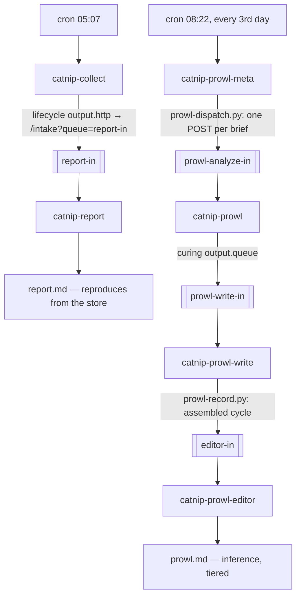

# Reference tannery — catnip

A leather deployment that has been running unattended against a live workload,
studied here as a whole system rather than as a feature demo.

**Source:** [`TGPSKI/catnip/tannery`](https://github.com/TGPSKI/catnip/tree/2033b0d9c8d5739995e2aec4087130babcce699d/tannery)
(pinned at `2033b0d`). [catnip](https://github.com/TGPSKI/catnip) captures,
analyses and retains GitHub repo traffic locally; the tannery runs it
unattended and turns each day's data into two documents.

## Why it is not in `examples/`

Every example under [`examples/`](../examples/) runs from a fresh clone with a
single `make` target. This one cannot: it needs `catnip` installed, a store
with real history, and a served model. A vendored copy would not run, and would
drift from the system it documents. It stays upstream, pinned, and is read here.

The numbered examples each show one mechanism. This shows six agents, four
queues and a 41-minute job running together.

## Topology



| agent | trigger | does |
|---|---|---|
| `catnip-collect` | cron, daily 05:07 | runs the fetch pipeline, then checks the data landed |
| `catnip-report` | `report-in` | writes the deterministic report |
| `catnip-prowl-meta` | cron, every 3rd day 08:22 | sizes the cycle, seeds N analyst briefs |
| `catnip-prowl` | `prowl-analyze-in` | investigates one brief; concurrency 2 |
| `catnip-prowl-write` | `prowl-write-in` | files the analysis in one call |
| `catnip-prowl-editor` | `editor-in` | merges the cycle into one document, guarded publish |

Two agents are on cron. Everything else runs when its input arrives.

## What it demonstrates

### Stages are joined by queues, not by clock arithmetic

A second cron guessing when a 41-minute fetch will finish is a race that fails
silently on a slow day. Instead the producer's lifecycle posts its own output
to leather's `/intake`, which stores it as a hide and enqueues it:

```yaml
# agents/catnip-collect.lifecycle.yaml
output:
  - type: file
    path: .state/artifacts/{{.date}}-catnip-collect.txt
  - type: http
    url: http://127.0.0.1:7751/intake?kind=collect.result&source=catnip-collect&queue=report-in
```

The consuming curing names the same queue at its own end, and a curing can
name its successor's queue as its output — which is how the analyst fans back
into the writer without either knowing about the other:

```yaml
# curings/analyze.curing.yaml
name: analyze
agent: catnip-prowl
queue: prowl-analyze-in
output:
  queue: prowl-write-in
```

The queue name is the whole routing fact. The report runs when collect
delivers, however long the fetch took; if the fetch fails and the store has
not advanced, the report writer refuses and the run records `skipped` rather
than describing yesterday as today.

### A turn *replaces* the tool scope, it does not extend it

Each agent is multi-turn, and each turn declares the toolsets it holds. The
collect agent runs the pipeline in a turn that cannot write state, verifies in
a turn that cannot run the pipeline, and only reaches the state writer last:

```markdown
---
name: catnip-collect
toolsets: [catnip-pipeline]     # turn 1: catnip-run, nothing else
---
...
---
toolsets: [catnip-inspect, catnip-status]   # turn 2: verify and read
...
---
toolsets: [catnip-record]                   # turn 3: write_state
```

`catnip-prowl` holds read tools and only read tools, for its whole run. The
scope is a capability boundary, not a prompt-length optimisation.

### Verdicts come from tools, not from text

`catnip run` streams ~41 minutes of progress that reads identically on success
and on failure, so no agent is asked to judge it. `catnip-verify` asserts the
CSVs exist and `catnip-store-status` reads the store's newest day; the agent's
`success` / `failed` verdict has to cite those. The prompt says so in the
negative — *"Never decide from that text"* — and the turn that sees the stream
has no tool with which to record a verdict anyway.

### Measured values reach later turns verbatim

Extract rules on the skill lift values out of tool output and into the
variables later turns interpolate, so a state file never contains a model's
transcription of a number:

```yaml
# tools/catnip-tools.skill.yaml
extract:
  - tool: catnip-store-status
    pattern: '"latest_day":\s*"([0-9]{4}-[0-9]{2}-[0-9]{2})"'
    store: latest_day
```

The convention the prompts carry: **`{{...}}` means a tool measured it;
`<...>` means the model writes it.** Only judgment fields — an `action`, a
`reason`, a finding's prose — are the model's to fill in.

### Fan-out is sized by judgment; fan-in is free

The meta agent reads the report and decides how many briefs the cycle
deserves — a quiet window seeds one routine pass, a rich one seeds an angle
per phenomenon. Each brief becomes one `/intake` POST, so N is data, not
configuration. Collation needs no join step: the writer's per-cycle files
accumulate every package that arrives, and publishing dedupes into a staged
assembly.

### One deterministic call beats N calls the model has to count

The number of findings varies per cycle, so a writer making one tool call per
block silently drops one whenever its count is off. `catnip-prowl-record`
takes the whole analysis, parses the blocks itself, and files them all or
fails naming the block it refused. Provenance is enforced as argument
validation: a `tier` outside `measured|inferred|speculative` is rejected, and
so is any `evidence` that does not open with the catnip tool the claim rests
on. A claim that names no tool cannot be filed.

### Timeouts stack, and the innermost one is sized from a measurement

| layer | where | value for `catnip_run` |
|---|---|---|
| 1 | `shell-tools.json` `timeout_seconds` | 5400s — shell-mcp SIGKILLs the process |
| 2 | lifecycle `tool_timeout` | 6000s — leather abandons the MCP call |
| 3 | lifecycle `timeout` | 6600s — leather abandons the run |

A real run took 2459s against a first-draft bound of 2100s, which would have
killed the pipeline at 35 minutes and called it a timeout. Layer 1 defaults to
30s when omitted, and omitting it fails quietly: the process dies while its
child runs on as an orphan.

### The published file has exactly one writer

`prowl.md` is written only by the guarded publish in `prowl-edit-publish.py`,
which refuses a document whose tier counts changed and skips one the cycle has
already advanced past. The deterministic `report.md` and the inferential
`prowl.md` stay separate files, because one reproduces byte-for-byte from the
store and one does not.

## Measured: what decomposition bought

Numbers below come from `.state/runs/*.jsonl` run records over one build day
(2026-08-07), against `qwen36-35b-a3b-nvfp4` — a 35B MoE with ~3B active
parameters, NVFP4-quantized, served by vLLM on one local GPU.

| agent | runs | ok | tokens (med) | duration (med) |
|---|---|---|---|---|
| `catnip-collect` | 1 | 1 | 9.1k | 2510s |
| `catnip-report` | 18 | 18 | 6.4k | 3.8s |
| `catnip-prowl-meta` | 4 | 4 | 101k | 40s |
| `catnip-prowl` | 26 | 26 | 60k | 43s |
| `catnip-prowl-write` | 31 | 27 | 9.5k | 5.7s |
| `catnip-prowl-editor` | 7 | 5 | 30k | 36s |
| monolithic analyst (before decomposition) | 7 | 6 | 155k | 237s |

Token totals count prompt tokens re-sent per tool round, so they are compute
cost, not information volume: the meta's 101k median is roughly 10k of context
resent across ~10 rounds.

Compare the last row to the fourth. The pre-decomposition monolithic analyst
ran 237s at a 155k median and never completed a recorded cycle. The decomposed
analyst runs 43s at 60k, 26 for 26. Each of the 4 writer and 2 editor failures
is a validation guard refusing malformed or stale input, not a crash.

A full rich cycle — meta, six analysts, six writer runs, editor passes — costs
roughly 700–800k tokens and about 15 minutes of wall clock at queue concurrency
2. On owned hardware the marginal cost is zero, which is what makes
guard-refuse-retry affordable: a refused attempt costs seconds, and the guard
plus one retry outperformed prompting the behaviour in.

### What each leather capability removes from the model

Each row was exercised in this build:

| leather capability | what the model no longer has to do |
|---|---|
| curings + queues (stage isolation) | hold the whole problem. Each stage sees one brief, one package, one assembly — a few KB. The 228K context window was never needed |
| `extract:` rules carrying `{{key}}` across turns | transcribe values. A small model garbles copied numbers; extracts carry every measured value verbatim |
| per-turn tool scoping (replace, not extend) | choose tools under temptation. A read turn physically cannot write; the editor's compose turn holds no tools at all |
| shell-tool argument `patterns` | be trusted to format arguments. A tier outside the enum never reaches disk |
| dedupe / replay guard | avoid repeat-call loops. Observed absorbing five identical `store-status` calls from a looping meta without re-executing them |
| truncation auto-retry with a larger reserve | budget its own context. Observed twice, recovering long generations the model under-reserved for |
| cron + intake + curing chaining | decide what runs next. Delivery decides |
| run persistence (`runs/*.jsonl`) | nothing — but it is why every number here is checkable and every failure was diagnosable from records rather than from re-runs |

The other half is not leather but the pattern built on it: deterministic
scripts at both ends of every model stage. Dispatch parses the seed blocks, the
recorder parses the finding blocks, edit-publish enforces tier-count fidelity.
Leather mounts these as shell tools; using them is the operator's discipline.

No fix in the build day's failure ledger required a bigger model. The 35B's
failures were not reasoning failures — during a guard retry it correctly
diagnosed its own count mismatch. They were boundary failures, at each place
the design implicitly trusted the model to count, name, quote, or self-report.
Each fix replaced trust with mechanism. A frontier model would have crossed
some of those gaps on raw capability and hidden them.

## The A/B against a frontier control

Run the same evening, on the same store and the same day's data.

**Control:** a frontier agent (Claude Fable), fresh context, blind — no access
to the tannery's output, the reference document, or any session notes —
executing the repo's own `catnip-prowl` skill single-shot. 64k tokens, 27 tool
calls, 7.5 minutes, one context.

**Treatment:** the tannery's published document — six seeded analysts, writer,
editor — at roughly 750k local tokens and about 15 minutes.

| dimension | tannery (local 35B pipeline) | frontier control (single-shot) |
|---|---|---|
| findings | 9 (5 measured / 4 inferred) + 2 corrections | 11 (1 measured / 8 inferred / 2 speculative) |
| refutations | 8 | 5, including two hypotheses the tannery never tested |
| shared findings | correct | correct, usually crisper |
| errors detected in either | none | none |
| tier discipline | good after tuning | excellent untuned |

**Verdict: the control produced the better document.** It found the one finding
that would change operator behaviour, and the best synthesis in either
document. The tannery matched frontier structure, matched correctness where the
two overlapped, and was blind to the rest.

The gap has two separate causes:

1. **Evidence access — fixable, and most of the gap.** The control read raw
   store fields the tannery has no tools for. Nearly every control-only finding
   rests on those fields, so the analysts could not have found them at any
   model size. Adding the tools and re-running the A/B is the experiment that
   separates tool surface from model capability.
2. **Whole-store synthesis — the ceiling.** Unifying separate episodes across
   the full store into one explanation requires seeing everything at once. The
   meta stage sees summaries; the analysts see briefs. This is a property of
   the decomposition, not of the model.

Cost runs the other way: 64k metered frontier tokens against ~750k free local
ones. At a three-day cadence both are cheap, so the local pipeline's case is
privacy, autonomy and zero marginal cost, not token efficiency.

Expect the recipe to break on tasks that need global context in one place at
one time: long-horizon narrative, whole-corpus cross-referencing beyond what a
brief can carry, and judgments where the decomposition itself is the hard part.
The meta stage is the current answer to "who sees the whole", and it sees only
summaries.

The decomposition gets a local 35B to frontier-shaped form and frontier-grade
reliability on what it can see. What it can see is set by its tools; what it
can synthesize is capped by the widest single context in the design.

## What running it cost leather

Half of [v0.5.2](../CHANGELOG.md#052--2026-08-09) came out of wiring and
operating this tannery. Each defect presented the same way: no error, just a
run that looked successful.

| symptom in the tannery | fixed in leather |
|---|---|
| fourteen tools written flow-style, every one undispatchable, `validate` clean | [#74](https://github.com/TGPSKI/leather/issues/74) |
| two skills sharing a tool name killed the whole registry at WARN; the agent fabricated its tool calls as text | [#71](https://github.com/TGPSKI/leather/issues/71) |
| a `*.skill.yaml` named under `toolsets:` contributed nothing, silently | [#73](https://github.com/TGPSKI/leather/issues/73) |
| an agent resolving to zero tools ran anyway, prompt still naming them | [#72](https://github.com/TGPSKI/leather/issues/72) |
| `--queue` alone routed over HTTP but not from the CLI, and neither said so | [#75](https://github.com/TGPSKI/leather/issues/75) |
| CLI ingest against a running serve enqueued into a file the serve then overwrote | [#76](https://github.com/TGPSKI/leather/issues/76) |
| `leather status` reported a 30-hour-dead scheduler exactly as it reports a healthy idle one | [#77](https://github.com/TGPSKI/leather/issues/77) |

The tannery carried local guards for the first four — a `registry-check.py`
and a flow-style rejection — and the fix was to move them into the runtime,
where every tannery gets them, rather than leave each deployment carrying its
own copy of the lint.

## Running it

Requires `catnip` on `PATH`, `leather` on `PATH`, and any OpenAI-compatible
endpoint. No frontier model is needed — every number an agent reports comes
back from a tool. It runs on a served `qwen36-35b-a3b-nvfp4`.

```bash
cd tannery
make validate     # leather validate every agent, lifecycle and toolset
make smoke-tools  # exec each read-only tool's exact argv, for real
make serve        # run the scheduler
```

`make smoke-tools` execs each read-only tool's argv straight from
`shell-tools.json`, so an argv or quoting regression surfaces there instead of
at 05:07 with nobody watching. Writers are deliberately skipped: a smoke test
that fetches the whole account is not a smoke test.

## Reading the source

All links pinned at [`2033b0d`](https://github.com/TGPSKI/catnip/tree/2033b0d9c8d5739995e2aec4087130babcce699d/tannery).

| file | what to read it for |
|---|---|
| [`README.md`](https://github.com/TGPSKI/catnip/blob/2033b0d9c8d5739995e2aec4087130babcce699d/tannery/README.md) | the operator's account of the whole chain |
| [`tannery.yaml`](https://github.com/TGPSKI/catnip/blob/2033b0d9c8d5739995e2aec4087130babcce699d/tannery/tannery.yaml) | four queues, each with its own concurrency and depth |
| [`config.yaml`](https://github.com/TGPSKI/catnip/blob/2033b0d9c8d5739995e2aec4087130babcce699d/tannery/config.yaml) | a real budget: 16384 tokens, reserves, `persist_runs_detail: tools` |
| [`curings/`](https://github.com/TGPSKI/catnip/tree/2033b0d9c8d5739995e2aec4087130babcce699d/tannery/curings) | four curings, one chained via `output.queue` |
| [`agents/catnip-collect.agent.md`](https://github.com/TGPSKI/catnip/blob/2033b0d9c8d5739995e2aec4087130babcce699d/tannery/agents/catnip-collect.agent.md) | per-turn scope replacement, and a prompt that forbids judging a stream |
| [`tools/catnip-tools.skill.yaml`](https://github.com/TGPSKI/catnip/blob/2033b0d9c8d5739995e2aec4087130babcce699d/tannery/tools/catnip-tools.skill.yaml) | every extract rule in one place |
| [`tools/*.toolset.yaml`](https://github.com/TGPSKI/catnip/tree/2033b0d9c8d5739995e2aec4087130babcce699d/tannery/tools) | ten single-purpose scopes, which is what per-turn scoping costs |
| [`scripts/prowl-record.py`](https://github.com/TGPSKI/catnip/blob/2033b0d9c8d5739995e2aec4087130babcce699d/tannery/scripts/prowl-record.py) | provenance enforced as argument validation |
| [`scripts/prowl-edit-publish.py`](https://github.com/TGPSKI/catnip/blob/2033b0d9c8d5739995e2aec4087130babcce699d/tannery/scripts/prowl-edit-publish.py) | the guarded single writer |

Run records backing the measurements are in that tannery's
`.state/runs/*.jsonl`. The per-agent table, the failure ledger and the A/B
come from an operator meta-analysis written 2026-08-07 over one build day;
the operator's own traffic findings are deliberately not reproduced here,
since only the harness conclusions are leather's to publish.
