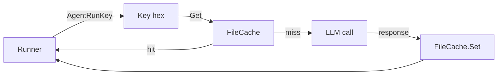

# cache

> SHA-256 keyed file cache for agent responses.

## Responsibility

`cache` provides a deterministic content-addressed store for agent run output.
Keys are computed from agent name, system prompt, user prompt, and model.
TTL-based expiration is enforced lazily on read — expired entries are deleted
on the first `Get` that hits them.

The runner checks the cache before making any LLM call and writes to it after
a successful non-empty response.

## Public API

### Types

| Symbol | Description |
|---|---|
| `FileCache` | Persistent cache backed by the filesystem. Root dir is set at construction. |

### Functions

| Symbol | Signature | Description |
|---|---|---|
| `NewFileCache` | `(dir string) (*FileCache, error)` | Create (or open) a file-system cache rooted at `dir`. Creates the dir with mode 0700 if needed. |
| `AgentRunKey` | `(agentName, systemPrompt, userPrompt, model string) string` | Compute a 64-char lowercase hex SHA-256 of the four NUL-separated fields. Stable across runs. |
| `(*FileCache).Get` | `(key string) (string, bool)` | Retrieve a cached value. Returns `(value, true)` if present and not expired; `("", false)` on miss, expired entry (which is also deleted), or unmarshal error. |
| `(*FileCache).Set` | `(key, value string, ttl time.Duration) error` | Atomically write `value` (mode 0600) with the given ttl. `ttl == 0` means the entry never expires. |

## Internal Design

### Key computation

```
SHA-256(agentName ‖ "\x00" ‖ systemPrompt ‖ "\x00" ‖ userPrompt ‖ "\x00" ‖ model ‖ "\x00")
```

Fields are separated by NUL bytes so no field value can shift the boundary
into an adjacent field. The digest is hex-encoded.

The runner is responsible for collapsing multi-turn agents into a stable
`userPrompt` value before calling `AgentRunKey` — multi-turn prompts are
joined with `\x01` so two agents that share a single `UserPrompt` but
differ in later turns do not collide.

### File layout

```
<dir>/
  <key>.json       — {"value":"...","expires_at":<unix-seconds>}
```

`expires_at == 0` indicates a non-expiring entry.

### Atomic writes

`Set` writes to `<key>.json.tmp` first, then renames over `<key>.json`.
Partial writes are never visible.

### TTL check

`Get` reads `expires_at` and compares against `time.Now().Unix()`.
Expired entries are deleted with a best-effort `os.Remove` before returning miss.

### File permissions

All written files use mode `0600`. The directory is created with mode `0700`.
This matches the repository hard rule that temporary files may not have
permissions wider than `0600`.

## Dependencies

`internal/cache` has no intra-project imports — stdlib only.

The runner consumes `model.CacheConfig` (Enabled bool, TTL Duration) to decide
whether to call into this package.

## Data Flow



## Test Surface

`internal/cache/cache_test.go` and `internal/cache/key_test.go`:

- `AgentRunKey` determinism: same inputs → same key.
- `AgentRunKey` distinct-input separation across all four fields.
- `AgentRunKey` no-boundary-collision: `("ab","","u","m")` ≠ `("a","b","u","m")` proves the NUL separator works.
- `Set + Get` round-trip: retrieved value matches written value.
- TTL expiration: expired entry returns miss and is deleted from disk.
- Zero TTL: entry never expires.
- Persistence: a fresh `*FileCache` over the same dir reads previously-written entries.

## Related Docs

- [docs/modules/runner.md](runner.md) — integrates cache for pre-LLM lookup.
- [docs/ARCHITECTURE.md](../ARCHITECTURE.md) — cache in the execution pipeline.
