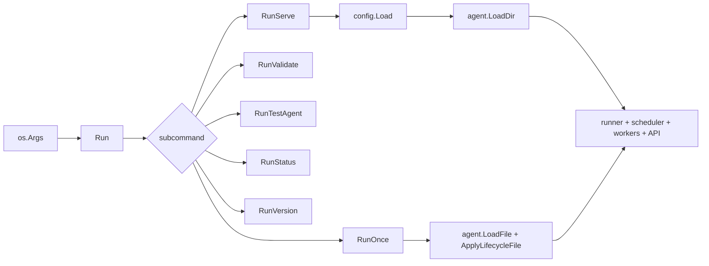

# cli

> Subcommand dispatch, serve orchestration, replay/UI surfaces, and command-specific handlers.

## Responsibility

`cli` is the top-level composition layer for leather. It parses subcommands and
shared flags, loads configuration, assembles the runtime dependencies for each
command, starts the scheduler and worker supervisor in `serve`, exposes the
HTTP API and replay endpoints, and provides testable command handlers for
`init`, `doctor`, `run`, `validate`, `test-agent`, `status`,
`ingest`, `workflow`, `replay`, `snapshot`, `dlq`, `attach`, `version`, and
`completion`.

## Public API

| Symbol | Signature | Description |
|--------|-----------|-------------|
| `Run` | `func Run(args []string, stdout, stderr io.Writer, version, commit string) int` | Main command dispatcher used by `cmd/leather/main.go`. |
| `RunInit` | `func RunInit(args []string, stdout, stderr io.Writer) int` | Scaffold `~/.leather` with `.env`, `config.yaml`, example agent, and `Makefile`. Fails closed on existing files unless `--overwrite` is set. |
| `RunDoctor` | `func RunDoctor(args []string, stdout, stderr io.Writer) int` | Print every effective config value with source attribution; redacts `llm_api_key`. |
| `RunServe` | `func RunServe(args []string, stdout, stderr io.Writer, version, commit string) int` | Start the scheduler, optional API, optional replay modes, workers, and runtime wiring. |
| `RunOnce` | `func RunOnce(args []string, stdout, stderr io.Writer) int` | Execute one `*.agent.md` file once, optionally using a co-located lifecycle file. |
| `RunValidate` | `func RunValidate(args []string, stdout, stderr io.Writer) int` | Validate config, agents, lifecycles, skills, workers, and MCP server definitions. |
| `RunTestAgent` | `func RunTestAgent(args []string, stdout, stderr io.Writer) int` | Run an agent with `MockLLM` and optional fake tool responses. |
| `RunStatus` | `func RunStatus(args []string, stdout, stderr io.Writer) int` | Print current config summary and persisted scheduler state. |
| `RunIngest` | `func RunIngest(args []string, stdout, stderr io.Writer) int` | Store raw bytes as a hide and optionally enqueue for curing. |
| `RunWorkflow` | `func RunWorkflow(args []string, stdout, stderr io.Writer) int` | Dispatch `leather workflow` subcommands, including bounded one-shot tannery runs. |
| `RunReplay` | `func RunReplay(args []string, stdout, stderr io.Writer, version, commit string) int` | Replay a captured snapshot or runs directory via the API. |
| `RunSnapshot` | `func RunSnapshot(args []string, stdout, stderr io.Writer) int` | Save or restore a point-in-time `tar.gz` archive of runtime state. |
| `RunDLQ` | `func RunDLQ(args []string, stdout, stderr io.Writer) int` | Inspect and requeue outbound dead-letter queue items. |
| `RunAttach` | `func RunAttach(args []string, stdout, stderr io.Writer) int` | Join a running `serve` instance and stream pretty-printed DevTools events. |
| `RunVersion` | `func RunVersion(_ []string, stdout, _ io.Writer, version, commit string) int` | Print build metadata. |
| `RunCompletion` | `func RunCompletion(args []string, stdout, stderr io.Writer) int` | Print a static bash/zsh/fish completion script (`leather completion <shell>`). |
| `ResolveBuildVersion` | `func ResolveBuildVersion(version, commit string) (string, string)` | Fill in version/commit from embedded Go build info when `-ldflags` stamps are absent (`go install module@tag` builds). |

## Internal Design

`Run` handles `help`, `--help`, and `-h` directly, then dispatches by the first
argument. Every command builds its own `flag.FlagSet` with
`flag.ContinueOnError`, calls `config.BindFlags`, and then loads a resolved
`model.Config` through `config.Load`.

`RunServe` is the largest composition path. After log setup it short-circuits
into snapshot replay or live replay when `--replay` or `--replay-live` is set.
In normal mode it loads agents, builds the scheduler, queue manager, cache,
tool registry, worker supervisor, notify backends, and MCP registry, then
registers each agent with a shared `runner.Runner`. It also owns run-history
persistence, pretty-mode progress rendering, graceful shutdown, and optional
HTTP status APIs.

`RunOnce` uses a positional agent path instead of an `--agent` flag. It loads
the base agent file, applies a same-stem lifecycle file when present, merges in
global defaults, initializes tool and MCP registries, prompts for empty
parameter values declared by lifecycle files or skills, and optionally repeats
the run with `--loop`.

`RunValidate` performs staged validation: config file schema, agent loading,
front-matter and lifecycle schema checks, skill schemas, worker schemas, and
`mcp-servers.yaml` schema. `RunTestAgent` reuses most of the run wiring but
swaps in `session.MockLLM` and optional canned tool results so agent logic can
be exercised without a live model.

`RunCompletion` prints one of three static, hand-maintained shell scripts
(`internal/cli/completion.go`) that mirror the `Run` dispatch table and each
command's flag registrations. There is no dynamic `__complete` callback into
the binary; the scripts embed the command/subcommand/flag lists directly, so
they must be updated alongside `cli.go` and the relevant `cmd_*.go` file when
a command, subcommand, or flag changes — the same convention `help.go`'s
`usage` string already follows.

### Serve API

When `--api` is enabled, `RunServe` exposes JSON endpoints including:

- `GET /healthz`
- `GET /jobs`
- `GET /jobs/{name}`
- `GET /status`
- `GET /config`
- `GET /metrics`
- `GET /history`
- `GET /snapshot`
- `POST /replay/control` in replay-live mode

The API adds permissive CORS headers to these routes.

## Dependencies

| Package | Why |
|---|---|
| `internal/agent` | Load base agents and lifecycle definitions. |
| `internal/config` | Shared flag binding and config merging. |
| `internal/schema` | Validation handlers in `validate`. |
| `internal/logging` | Structured log setup for all commands. |
| `internal/model` | Shared config, agent, run, and API response types. |
| `internal/runner` | Shared execution loop for `serve`, `run`, and `test-agent`. |
| `internal/session` | HTTP and mock LLM clients. |
| `internal/tool` | Tool and toolset registry loading. |
| `internal/mcp` | MCP server loading and startup. |
| `internal/scheduler` | Scheduler state and execution dispatch. |
| `internal/cache` | Response cache setup for serve-mode runs. |
| `internal/queue` | Queue manager for worker and output-route integration. |
| `internal/worker` | Worker supervisor lifecycle in `serve`. |
| `internal/notify` | Notify backend initialization. |

## Data Flow

```mermaid
flowchart LR
    ARGS[os.Args] --> RUN[Run]
    RUN --> DISPATCH{subcommand}
    DISPATCH --> SERVE[RunServe]
    DISPATCH --> ONCE[RunOnce]
    DISPATCH --> VAL[RunValidate]
    DISPATCH --> TEST[RunTestAgent]
    DISPATCH --> STATUS[RunStatus]
    DISPATCH --> VERSION[RunVersion]

    SERVE --> CFG[config.Load]
    CFG --> AG[agent.LoadDir]
    AG --> RUNTIME[runner + scheduler + workers + API]
    ONCE --> ONEAG[agent.LoadFile + ApplyLifecycleFile]
    ONEAG --> RUNTIME
```

## Test Surface

`internal/cli/cmd_test.go` covers top-level dispatch, `resolveAgent`, pretty
output helpers, and core `run`/`status` behavior. `internal/cli/cmd_test_agent_test.go` covers
mock-agent execution with lifecycle and canned tool responses. `internal/cli/api_test.go`
covers the HTTP API and CORS headers. `internal/cli/cmd_serve_test.go` covers
latency percentile helpers used by serve-mode metrics.

## Related Docs

- [docs/modules/config.md](config.md)
- [docs/modules/agent.md](agent.md)
- [docs/modules/runner.md](runner.md)
- [docs/modules/schema.md](schema.md)
- [docs/ARCHITECTURE.md](../ARCHITECTURE.md)
