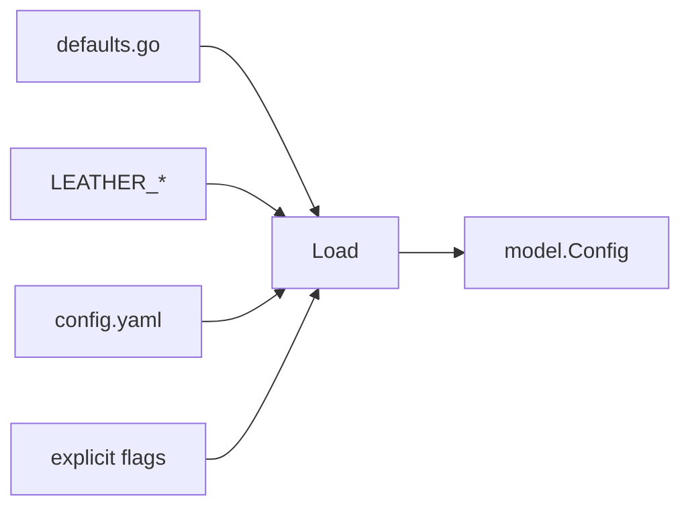

# config

> Shared flag binding, YAML loading, and merged runtime configuration.

## Responsibility

`config` centralizes every shared runtime option used by leather commands. It
registers the common flag set, resolves home-directory defaults, folds in
`LEATHER_*` environment variables, overlays `config.yaml`, parses notify
backend blocks, and returns a fully resolved `model.Config` value.

## Public API

| Symbol | Signature | Description |
|--------|-----------|-------------|
| `Load` | `func Load(fs *flag.FlagSet) (model.Config, error)` | Merge shared defaults, env vars, YAML config, and explicitly set flags into one `model.Config`. |
| `BindFlags` | `func BindFlags(fs *flag.FlagSet)` | Register the full shared leather flag set on a `flag.FlagSet`. |
| `ParseBlock` | `func ParseBlock(src string) (map[string]string, map[string][]string)` | Parse a flat YAML block into scalar and list maps for downstream packages. |

## Defaults

| Constant | Value |
|---|---|
| `DefaultModel` | `""` |
| `DefaultTemperature` | `0.7` |
| `DefaultMaxTokens` | `8192` |
| `DefaultCompletionReserve` | `1024` |
| `DefaultSummarizeThreshold` | `0.85` |
| `DefaultLLMEndpoint` | `http://localhost:11434` |
| `DefaultLLMTimeout` | `60s` |
| `DefaultSchedulerTick` | `1m` |
| `DefaultMaxConcurrentJobs` | `4` |
| `DefaultLogLevel` | `"info"` |
| `DefaultLogFormat` | `"text"` |
| `DefaultPrettyMode` | `"all"` |
| `DefaultAPI` | `false` |
| `DefaultAPIAddr` | `127.0.0.1:7749` |
| `DefaultRunMaxBytes` | `10485760` |
| `DefaultReplaySpeed` | `1.0` |
| `DefaultMaxToolRounds` | `5` |

Home-relative path defaults such as `AgentDir`, `ConfigFile`, and `StateDir`
are resolved at load time rather than exported as constants.

## Internal Design

The implementation has one subtle but important precedence rule. `BindFlags`
uses env-resolved values as flag defaults, then `Load` overlays YAML config,
then applies explicitly visited flags. In practice that means:

1. Explicit CLI flags win.
2. YAML config overrides env-seeded defaults.
3. Environment variables override built-in defaults.
4. Built-in defaults fill everything else.

`Load` pre-scans `fs.Visit` for `--config` before reading the config file so a
user can relocate the YAML file without a bootstrap cycle. Missing config files
are ignored; malformed ones fail closed.

The YAML parser is intentionally small and stdlib-only. `parseYAML` handles the
flat scalar/list surface of `config.yaml`, while `parseNotifyBackends` handles
the nested notification block. `ParseBlock` is exported so `agent` and `schema`
can reuse the same flat parsing rules.

Every shared flag has a matching `LEATHER_*` environment variable. Complex list
flags such as `default-toolsets` are represented as comma-separated env values
or YAML lists.

## Dependencies

| Package | Why |
|---|---|
| `internal/model` | Produces the final `model.Config` value. |

## Data Flow

## Test Surface

`internal/config/config_test.go` covers YAML scalar and list parsing,
`ParseBlock`, home-directory expansion, explicit flag overrides, env fallback
behavior for invalid values, config-file loading, and the current precedence
rules for defaults, env, YAML, and flags.

## Related Docs

- [docs/modules/model.md](model.md)
- [docs/modules/schema.md](schema.md)
- [docs/modules/agent.md](agent.md)
- [docs/ARCHITECTURE.md](../ARCHITECTURE.md)
