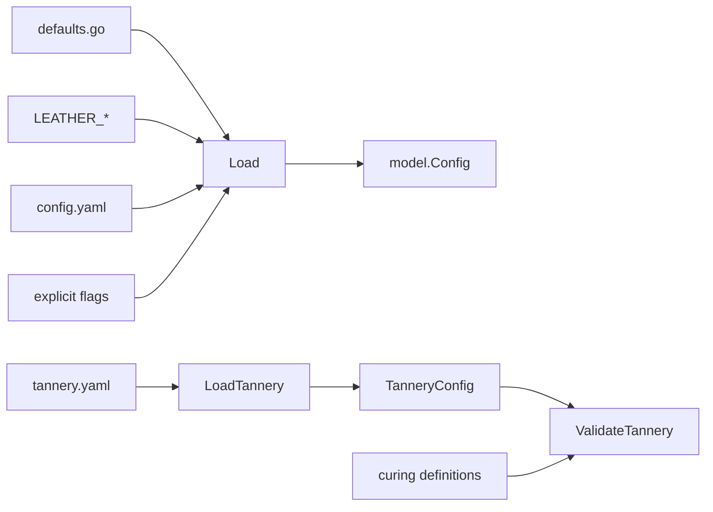

# config

> Shared flag binding, YAML loading, and merged runtime configuration.

## Responsibility

`config` centralizes every shared runtime option used by leather commands. It
registers the common flag set, resolves home-directory defaults, folds in
`LEATHER_*` environment variables, overlays `config.yaml`, parses notify
backend blocks, and returns a fully resolved `model.Config` value.

It also owns the second, independent config surface: `tannery.yaml`, loaded by
`LoadTannery` into a `TanneryConfig`. Tannery settings do not participate in the
flag/env/YAML precedence chain below — they are read from one file only.

## Public API

| Symbol | Signature | Description |
|--------|-----------|-------------|
| `Load` | `func Load(fs *flag.FlagSet) (model.Config, error)` | Merge shared defaults, env vars, YAML config, and explicitly set flags into one `model.Config`. |
| `BindFlags` | `func BindFlags(fs *flag.FlagSet)` | Register the full shared leather flag set on a `flag.FlagSet`. |
| `ParseBlock` | `func ParseBlock(src string) (map[string]string, map[string][]string)` | Parse a flat YAML block into scalar and list maps for downstream packages. |
| `TanneryConfig` | `type TanneryConfig struct` | Tannery settings from `tannery.yaml`: `HideDir`, `CuringDir`, `ArtifactDir`, `Routes []model.TanneryRoute`, `Queues map[string]model.QueueConcurrencyConfig`, `Webhooks []model.WebhookConfig`. |
| `LoadTannery` | `func LoadTannery(path string) (TanneryConfig, error)` | Parse `tannery.yaml`. Returns a zero-value `TanneryConfig` — not an error — when `path` does not exist. Relative paths resolve against the directory of `path`; `{{env:VAR}}` secrets expand from `os.Getenv`. |
| `ValidateTannery` | `func ValidateTannery(cfg TanneryConfig, defs []model.CuringDefinition) error` | Verify every route references a loaded curing definition and a declared queue. Routes carrying `queue_pattern` skip the static queue check. Fail-fast at serve startup: callers treat a non-nil return as fatal. |

## Defaults

| Constant | Value |
|---|---|
| `DefaultModel` | `""` |
| `DefaultTemperature` | `0.7` |
| `DefaultMaxTokens` | `8192` |
| `DefaultCompletionReserve` | `1024` |
| `DefaultReasoningReserve` | `0` |
| `DefaultSummarizeThreshold` | `0.85` |
| `DefaultLLMEndpoint` | `http://localhost:11434` |
| `DefaultLLMTimeout` | `60s` |
| `DefaultSchedulerTick` | `1m` |
| `DefaultMaxConcurrentJobs` | `4` |
| `DefaultLogLevel` | `"info"` |
| `DefaultLogFormat` | `"text"` |
| `DefaultPrettyMode` | `"all"` |
| `DefaultAPI` | `false` |
| `DefaultAPIAddr` | `127.0.0.1:7749` |
| `DefaultRunMaxBytes` | `10485760` |
| `DefaultReplaySpeed` | `1.0` |
| `DefaultMaxToolRounds` | `5` |
| `DefaultToolTimeout` | `600s` (0 = none) |
| `DefaultPersistRunsDetail` | `"none"` (or `"tools"`) |
| `DefaultPersistRunsToolCap` | `2048` (per-field byte cap for persisted tool traces) |

Home-relative path defaults such as `AgentDir`, `ConfigFile`, and `StateDir`
are resolved at load time rather than exported as constants.

## Internal Design

The implementation has one subtle but important precedence rule. `Load` seeds
from env-resolved defaults, overlays YAML config, then **re-applies present
`LEATHER_*` env vars over the YAML values** (`applyEnvOverrides`), and finally
applies explicitly visited flags. In practice that means:

1. Explicit CLI flags win.
2. Environment variables override YAML config.
3. YAML config overrides built-in defaults.
4. Built-in defaults fill everything else.

This is the conventional CLI order (flags > env > file > defaults) and is
pinned by tests (`TestLoad_EnvShowContextOverridesYAML`,
`TestLoad_EnvEndpointOverridesYAML`). An earlier revision of this document
stated the opposite (YAML over env), which sent at least one debugging session
to the wrong endpoint — the code has always applied env over YAML.

The config file itself resolves as: `--config` flag > `LEATHER_CONFIG` >
`~/.leather/config.yaml`. There is **no cwd auto-discovery**: a `./config.yaml`
in the working directory is not read unless named explicitly. Since v0.5.1,
falling back to the home config while a `./config.yaml` exists prints a
one-line stderr notice instead of failing silently (issue #30).

`Load` pre-scans `fs.Visit` for `--config` before reading the config file so a
user can relocate the YAML file without a bootstrap cycle. Missing config files
are ignored; malformed ones fail closed. `Load` also records per-key source
attribution (`Config.Sources`: yaml / env / flag, unmarked = default), which
`leather doctor` reports (issue #31).

The YAML parser is intentionally small and stdlib-only. `parseYAML` handles the
flat scalar/list surface of `config.yaml`, while `parseNotifyBackends` handles
the nested notification block. `ParseBlock` is exported so `agent` and `schema`
can reuse the same flat parsing rules.

Every shared flag has a matching `LEATHER_*` environment variable. Complex list
flags such as `default-toolsets` are represented as comma-separated env values
or YAML lists.

## Dependencies

| Package | Why |
|---|---|
| `internal/model` | Produces the final `model.Config` value. |

## Data Flow

```mermaid
flowchart LR
    DEF[defaults.go] --> LOAD[Load]
    ENV[LEATHER_*] --> LOAD
    YAML[config.yaml] --> LOAD
    FS[explicit flags] --> LOAD
    LOAD --> CFG[model.Config]

    TY[tannery.yaml] --> LT[LoadTannery]
    LT --> TC[TanneryConfig]
    TC --> VT[ValidateTannery]
    DEFS[curing definitions] --> VT
```

## Test Surface

`internal/config/config_test.go` covers YAML scalar and list parsing,
`ParseBlock`, home-directory expansion, explicit flag overrides, env fallback
behavior for invalid values, config-file loading, and the current precedence
rules for defaults, env, YAML, and flags.

`internal/config/tannery_test.go` covers `LoadTannery` (valid parse, missing and
empty paths, `{{env:VAR}}` expansion including the empty-secret case, defaults,
`max_depth`, `max_body_bytes`) and `ValidateTannery` (success plus routes
referencing an unknown curing, an unknown queue, and routes declared with no
curings loaded).

## Related Docs

- [docs/modules/model.md](model.md)
- [docs/modules/schema.md](schema.md)
- [docs/modules/agent.md](agent.md)
- [docs/modules/curing.md](curing.md)
- [docs/REFERENCE-TANNERY.md](../REFERENCE-TANNERY.md)
- [docs/ARCHITECTURE.md](../ARCHITECTURE.md)
