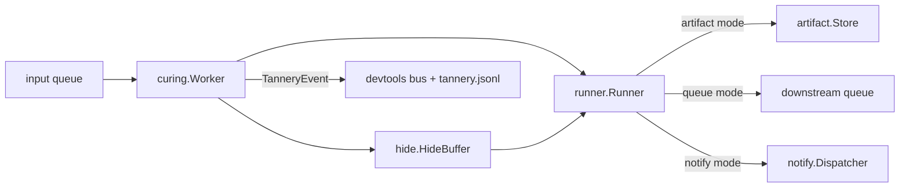

# curing

> Event-driven N-agent workflow that transforms hides into artifacts.

## Responsibility

A **curing** binds one agent to one input queue and produces one of:

- A new artifact written to the artifact store, or
- One or more new queue items dispatched to a downstream curing's queue, or
- A notify dispatch.

`curing` provides five pieces:

1. **`Worker`** — runs one curing definition: drains its queue, builds a `runner.Runner` per item, dispatches output, emits `TanneryEvent`s.
2. **`Supervisor`** — owns the lifecycle of every loaded `Worker`, starting and draining them with the serve process.
3. **`Router`** — matches incoming `(source, event_type)` pairs to one or more `model.TanneryRoute` records so a single webhook can fan out.
4. **`ResolveRouting`** — the single intake routing rule, shared by `POST /intake` and `leather ingest` so both agree on what a parameter set means.
5. **`LoadDir`** — loads `*.curing.yaml` files from disk into validated `model.CuringDefinition` values.

## Public API

### Types

| Symbol | Description |
|---|---|
| `TanneryEvent` | `Type, CuringName, AgentName, HideID, ArtifactID, CorrelationID, Payload, At`. Emitted on every state transition; published to the DevTools bus and tannery log. |
| `RunnerDeps` | Shared dependencies injected into every Worker (LLM client, registry, MCP, cache, notifiers, hide store, artifact store, queue manager, logger). |
| `Worker` | One curing in flight. |
| `Supervisor` | Goroutine-per-Worker manager. |
| `Router` | `[]model.TanneryRoute` matcher. |
| `RoutingRequest` | One intake's routing parameters plus the tannery state needed to resolve them: `Curing`, `Queue`, `Source`, `EventType`, `Router *Router` (may be nil), `Defs []model.CuringDefinition`, `Queues map[string]model.QueueConcurrencyConfig`. |
| `Routing` | The resolved destination: `Curing` (owning curing, `""` when none owns the queue), `Queue` (static destination, `""` when `QueuePattern` applies), `QueuePattern` (single-use template). The zero value means no destination matched. |

### Functions

| Symbol | Signature | Description |
|---|---|---|
| `NewWorker` | `(def model.CuringDefinition, deps RunnerDeps, eventFn func(TanneryEvent), eventFnConcurrent bool) *Worker` | Construct a worker. `eventFnConcurrent=false` (default) serializes event delivery so consumers don't need their own locks. |
| `(*Worker).Run` | `(ctx context.Context)` | Block until ctx is canceled. |
| `(*Worker).WaitInflight` | `()` | Wait for all currently-running items to finish; used during drain. |
| `(*Worker).ActiveCount` | `() int` | Item-handler goroutines currently running. |
| `(*Supervisor).TotalActive` | `() int` | Sum of in-flight item handlers across all workers. Non-zero means work is still in progress even when every queue reports depth 0, since items are dequeued before processing begins — quiescence checks must consult this, not queue depth alone. |
| `(*Worker).ProcessItem` | `(ctx context.Context, item model.QueueItem) error` | Run one queue item synchronously. Used by tests and `leather ingest`. |
| `NewSupervisor` | `(workers []*Worker, log *logging.Logger) *Supervisor` | Build a supervisor. |
| `(*Supervisor).Start` | `(ctx context.Context)` | Spawn one goroutine per worker. |
| `(*Supervisor).Drain` | `()` | Wait for all in-flight items, then return. |
| `NewRouter` | `(routes []model.TanneryRoute) *Router` | Construct from loaded routes. |
| `(*Router).Match` | `(source, eventType string) (model.TanneryRoute, bool)` | First matching route. |
| `(*Router).MatchAll` | `(source, eventType string) []model.TanneryRoute` | All matching routes (for fan-out). |
| `(*Router).Routes` | `() []model.TanneryRoute` | The ordered route list held by this Router. |
| `ResolveRouting` | `(req RoutingRequest) (Routing, error)` | Apply the intake routing rule; see [Intake routing](#intake-routing). Returns an error when the request names a destination that cannot route. |
| `(Routing).Routed` | `() bool` | Whether the intake resolved to a destination to enqueue on. |
| `(Routing).QueueFor` | `(hideID string) string` | Destination queue name, expanding `{{hide_id}}` in a single-use queue pattern. |
| `LoadDir` | `(dir string) ([]model.CuringDefinition, error)` | Load and validate every `*.curing.yaml` under `dir`. |

## Internal Design

### Intake routing

`ResolveRouting` is the one place that decides where an intake goes. Both
`POST /intake` and `leather ingest` call it, so a given parameter set means the
same thing on either path. The rule, in order:

1. A named curing routes to its declared queue — the curing definition already
   carries it, so `curing=` alone is enough.
2. A named queue routes to that queue, and picks up the name of the curing that
   consumes it when exactly one does.
3. With neither named, the route table decides from `source` and `event_type`.
4. With neither named and no route matching, the intake is hide-only: nothing is
   enqueued, and the zero `Routing` says so.

Cases 1–3 fail closed. A parameter set that names a destination which cannot
route returns an error rather than succeeding with the routing fields empty — an
unrouted ingest is otherwise indistinguishable downstream from a working
pipeline that has nothing to do (issue #75, v0.5.2).

Case 4 is the one silent path, and it is deliberate: naming no destination is a
request to store the hide and stop. Callers distinguish it with `Routing.Routed`.

`Routing.QueuePattern` defers queue naming until the hide ID exists. Always read
the destination through `Routing.QueueFor(hideID)`, never off the struct fields:
a route may populate both `Queue` and `QueuePattern`, and `QueueFor` resolves the
precedence — `QueuePattern` wins when set, expanding `{{hide_id}}`.

A named queue must be one some worker will actually poll: either declared under
the tannery's `queues:`, or inside the single-use namespace of a curing's
`queue_prefix`. Enqueuing anywhere else creates a file nothing reads, which is
why an undeclared queue is an error. Naming a curing that consumes only
single-use queues and declares no static `queue` is likewise an error — the
queue must be named explicitly.

### Curing modes

Each curing operates in exactly one input mode:

- **`prefix-scan`** — periodically scans a queue for items sharing a `correlation_id` prefix; runs the agent once N items are present (used for fan-in).
- **`collect`** — accumulates items until `collect_size` is reached; useful for batch curings.
- **`collect-from-queue`** — drains a specific named queue with a single-item loop.

The mode is selected from the `model.CuringDefinition` at load time.

### Per-item execution

`process` builds a fresh `*hide.HideBuffer`, loads any referenced hides, calls
`buildRunner` to produce a `runner.Runner` configured with the buffer and
hide-tool gating, then invokes `Run`. The resulting text is converted to an
artifact (and written) or to a queue item (and dispatched).

### Reflection turns

For curings whose first hide exceeds the inline budget,
`buildReflectionTurns` prepends a synthetic user turn that shows the model
the first cut and instructs reflection before paging — keeps long inputs
controllable.

### Event emission

`emit` invokes `eventFn` either inline (default) or in a goroutine
(`eventFnConcurrent=true`). Events surface in:
- `<state-dir>/tannery.jsonl` for replay.
- The DevTools bus via `sources.Wiring.PublishTannery`.

## Dependencies

| Package | Why |
|---|---|
| `internal/runner` | Per-item execution. |
| `internal/hide` | Buffer + persistent store. |
| `internal/artifact` | Artifact writes. |
| `internal/queue` | Input drain + downstream dispatch. |
| `internal/notify` | Notify-mode output dispatch. |
| `internal/model` | Curing definitions, routes, queue items, artifacts. |
| `internal/logging` | Structured logging. |

## Data Flow

```mermaid
flowchart LR
    Q[input queue] --> W[curing.Worker]
    W --> HB[hide.HideBuffer]
    W --> R[runner.Runner]
    HB --> R
    R -->|artifact mode| AS[artifact.Store]
    R -->|queue mode| Q2[downstream queue]
    R -->|notify mode| N[notify.Dispatcher]
    W -->|TanneryEvent| BUS[devtools bus + tannery.jsonl]
```

## Test Surface

`internal/curing/worker_test.go`, `router_test.go`, `loader_test.go`,
`intake_test.go`:

- Worker dispatches artifacts on success.
- Worker requeues on transient failure and routes to DLQ after `max_retries`.
- Router matches single + multi-route fan-out.
- LoadDir rejects unknown fields and invalid `output:` configs.
- `ResolveRouting` covers the rule table, `queue_pattern` routes, and the
  undeclared-queue error naming the declared queues.

## Related Docs

- [docs/modules/runner.md](runner.md)
- [docs/modules/hide.md](hide.md)
- [docs/modules/artifact.md](artifact.md)
- [docs/modules/config.md](config.md) — `LoadTannery`, `ValidateTannery`
- [docs/LEP-0008-conditional-routing.md](../LEP-0008-conditional-routing.md)
- [.subagents/AGENTS-TANNERY.md](../../.subagents/AGENTS-TANNERY.md)
