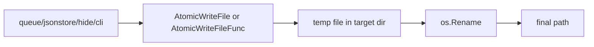

# fileutil

> Small shared filesystem helpers for atomic writes and existence checks.

## Responsibility

`fileutil` centralizes the low-level file-writing behaviour that several
persistent stores need: create parent directories, write to a temp file in the
same directory, apply the target mode, and atomically rename the temp file into
place. That keeps queue, hide, cache, snapshot, and JSON-store code from
duplicating fragile write-then-rename logic.

## Public API

| Symbol | Signature | Description |
|---|---|---|
| `Exists` | `func Exists(path string) bool` | Report whether a filesystem entry exists, treating permission errors as "exists". |
| `AtomicWriteFile` | `func AtomicWriteFile(path string, data []byte, perm os.FileMode) error` | Atomically write one byte slice to disk. |
| `AtomicWriteFileFunc` | `func AtomicWriteFileFunc(path string, perm os.FileMode, write func(w io.Writer) error) error` | Atomically write streamed content produced by a callback. |

## Internal Design

The key design choice is "temp file in the destination directory, then rename".
That preserves atomic replacement semantics on one filesystem and ensures
readers never observe a partially written file. Parent directories are created
with mode `0700`; callers choose the final file mode explicitly.

`AtomicWriteFileFunc` exists because several callers emit incremental data
through encoders rather than building one complete buffer first. The function
cleans up the temp file on every error path and leaves the destination
untouched when a write fails.

## Dependencies

Stdlib only.

## Data Flow

## Test Surface

`internal/fileutil/fileutil_test.go` covers existence checks, directory
creation, atomic replacement, cleanup on write failure, and streaming writes
through `AtomicWriteFileFunc`.

## Related Docs

- [docs/modules/jsonstore.md](jsonstore.md)
- [docs/modules/queue.md](queue.md)
- [docs/modules/hide.md](hide.md)
- [docs/ARCHITECTURE.md](../ARCHITECTURE.md)
