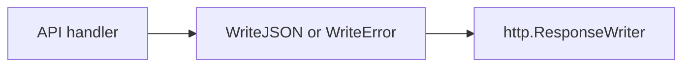

# httpx

> Shared JSON and error response helpers for leather's HTTP handlers.

## Responsibility

`httpx` is the tiny shared layer behind the API handlers in `internal/cli`.
It standardizes the JSON content type, status-code handling, and the common
`{"error":"..."}` response shape so individual handlers can stay focused on
runtime state and routing.

## Public API

| Symbol | Signature | Description |
|---|---|---|
| `WriteJSON` | `func WriteJSON(w http.ResponseWriter, status int, v any)` | Encode one value as JSON with the given HTTP status code. |
| `WriteError` | `func WriteError(w http.ResponseWriter, status int, msg string)` | Write a JSON error object with the given HTTP status code. |

## Internal Design

The package intentionally stays minimal: it does not own schema, auth, or
logging. `WriteJSON` always sets `Content-Type: application/json`, writes the
status code first, and then best-effort encodes the payload. `WriteError`
simply standardizes the common error envelope on top of `WriteJSON`.

## Dependencies

Stdlib only.

## Data Flow

## Test Surface

`internal/httpx/httpx_test.go` covers successful JSON encoding, status-code
propagation, and the exact error response shape emitted by `WriteError`.

## Related Docs

- [docs/modules/cli.md](cli.md)
- [docs/ARCHITECTURE.md](../ARCHITECTURE.md)
