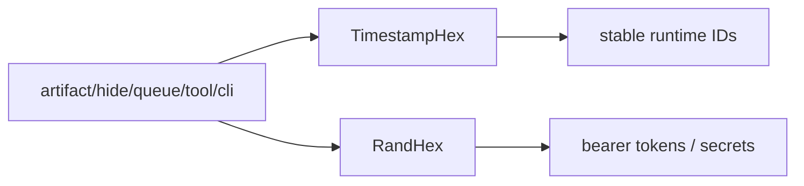

# ids

> Shared identifier and bearer-token generation helpers.

## Responsibility

`ids` owns the small set of ID formats reused across leather's persistent
stores and runtime surfaces. It generates timestamp-bucketed identifiers for
hides, queue items, artifacts, and related records, plus cryptographically
random hex tokens for secrets such as DevTools bearer auth.

## Public API

| Symbol | Signature | Description |
|---|---|---|
| `TimestampHex` | `func TimestampHex(prefix string) string` | Return an ID of the form `<prefix>_<yyyymmdd>_<HHMM>_<8hex>`. |
| `RandHex` | `func RandHex(n int) (string, error)` | Return `n` cryptographically random bytes hex-encoded as a `2n`-character string. |

## Internal Design

`TimestampHex` intentionally uses a non-cryptographic random suffix because its
job is uniqueness, not secrecy. The current 32-bit suffix was chosen to reduce
burst-load collisions in minute buckets used by fan-in and queue flows.

`RandHex` is the security-sensitive half of the package. It delegates to
`crypto/rand` and wraps errors so callers can distinguish entropy failures from
ordinary runtime issues.

## Dependencies

Stdlib only.

## Data Flow

## Test Surface

`internal/ids/ids_test.go` covers output shape and prefix formatting. The
package is small enough that its direct tests focus on formatting and length
guarantees rather than orchestration behaviour.

## Related Docs

- [docs/modules/artifact.md](artifact.md)
- [docs/modules/hide.md](hide.md)
- [docs/modules/queue.md](queue.md)
- [docs/modules/tool.md](tool.md)
- [docs/ARCHITECTURE.md](../ARCHITECTURE.md)
