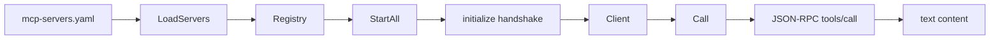

# mcp

> MCP server loading, stdio JSON-RPC clients, and named server registry management.

## Responsibility

`mcp` owns leather's client-side Model Context Protocol runtime. It parses
`mcp-servers.yaml`, starts long-lived stdio server processes, performs the
initialize handshake, and exposes named `Client` values through a registry for
tool execution. It does not know about agent prompts or tool selection; it is
the transport layer that `tool` and `runner` use when a tool has `type: mcp`.

## Public API

| Symbol | Signature | Description |
|--------|-----------|-------------|
| `Client` | `type Client struct { ... }` | Serialized JSON-RPC 2.0 client for one MCP server process. |
| `Registry` | `type Registry struct { ... }` | Name-keyed store of configured and started MCP clients. |
| `LoadServers` | `func LoadServers(path string) ([]model.MCPServerConfig, error)` | Parse `mcp-servers.yaml`. Missing files return an empty slice. |
| `NewRegistry` | `func NewRegistry(configs []model.MCPServerConfig) *Registry` | Build a registry from parsed server configs without starting processes. |
| `(*Registry).StartAll` | `func (r *Registry) StartAll(ctx context.Context) error` | Start all configured servers and run the initialize handshake. |
| `(*Registry).Get` | `func (r *Registry) Get(name string) (*Client, bool)` | Return a started client by server name. |
| `(*Registry).StopAll` | `func (r *Registry) StopAll()` | Best-effort stop every started server process. |
| `Start` | `func Start(ctx context.Context, cfg model.MCPServerConfig) (*Client, error)` | Launch one MCP server process and complete the initialize handshake. |
| `(*Client).Call` | `func (c *Client) Call(ctx context.Context, toolName string, args map[string]any) (string, error)` | Invoke one remote MCP tool and return joined text content. |
| `(*Client).Close` | `func (c *Client) Close() error` | Stop the underlying server process. |

## Internal Design

`LoadServers` uses a small line-oriented parser tailored to the `servers:` list
shape in `mcp-servers.yaml`. It validates only the fields leather needs:
`name`, `command`, and `transport`.

`Start` launches the configured command with `exec.Command`, not
`exec.CommandContext`, so the handshake context can expire without killing a
long-lived server that has already started successfully. After process startup,
`initialize` sends the MCP `initialize` request and then the
`notifications/initialized` notification.

`Client.Call` serializes all requests behind a mutex. That keeps the JSON
decoder simple and avoids multiple in-flight responses competing on the same
stdio stream. `readResponse` uses a goroutine plus `select` so context
cancellation still interrupts a blocked decode.

`extractTextContent` prefers MCP text content blocks and falls back to raw JSON
when the server returns an unexpected shape. That keeps error handling robust
for partially-compliant servers.

## Dependencies

| Package | Why |
|---|---|
| `internal/model` | Shared `MCPServerConfig` type for parsed config and registry wiring. |

## Data Flow

## Test Surface

`internal/mcp/mcp_test.go` re-invokes the test binary as a fake MCP server and
covers loader parsing, initialize handshake success, serialized repeated tool
calls, text-content extraction, registry start/get/stop behavior, and missing
file handling for `LoadServers`.

## Related Docs

- [docs/modules/tool.md](tool.md)
- [docs/modules/runner.md](runner.md)
- [docs/ARCHITECTURE.md](../ARCHITECTURE.md)