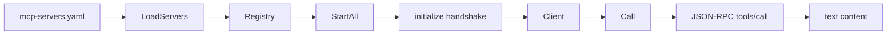

# mcp

> MCP server loading, stdio JSON-RPC clients, and named server registry management.

## Responsibility

`mcp` owns leather's client-side Model Context Protocol runtime. It parses
`mcp-servers.yaml`, starts long-lived stdio server processes, performs the
initialize handshake, and exposes named `Client` values through a registry for
tool execution. It does not know about agent prompts or tool selection; it is
the transport layer that `tool` and `runner` use when a tool has `type: mcp`.

## Public API

| Symbol | Signature | Description |
|--------|-----------|-------------|
| `Client` | `type Client struct { ... }` | Serialized JSON-RPC 2.0 client for one MCP server process. |
| `Registry` | `type Registry struct { ... }` | Name-keyed store of configured and started MCP clients. |
| `LoadServers` | `func LoadServers(path string) ([]model.MCPServerConfig, error)` | Parse `mcp-servers.yaml`. Missing files return an empty slice. |
| `NewRegistry` | `func NewRegistry(configs []model.MCPServerConfig) *Registry` | Build a registry from parsed server configs without starting processes. |
| `ToolError` | `type ToolError struct { Text string }` | Returned by `Call` when the server reported `isError: true`. `Text` carries the server-provided error content (e.g. stderr). |
| `ErrPoisoned` | `var ErrPoisoned error` | Returned by `Call` after a previous request timed out. The connection is no longer safe to use. |
| `(*Registry).StartAll` | `func (r *Registry) StartAll(ctx context.Context) error` | Start all configured servers and run the initialize handshake. Per-server failures are logged and skipped; returns an aggregate error only when zero servers started. Returns nil when none are configured. |
| `(*Registry).Get` | `func (r *Registry) Get(name string) (*Client, bool)` | Return a started client by server name. False when the server is unconfigured or not yet started. |
| `(*Registry).Recreate` | `func (r *Registry) Recreate(ctx context.Context, name string, stale *Client) (*Client, error)` | Close the poisoned client for `name`, start a fresh one, and swap it into the registry. |
| `(*Registry).StopAll` | `func (r *Registry) StopAll()` | Best-effort stop every started server process. |
| `(*Registry).ToolSchema` | `func (r *Registry) ToolSchema(server, tool string) map[string]any` | JSON Schema for `tool` on `server`. Nil when the server is not running or the schema was not fetched. |
| `Start` | `func Start(ctx context.Context, cfg model.MCPServerConfig) (*Client, error)` | Launch one MCP server process and complete the initialize handshake. |
| `(*Client).Call` | `func (c *Client) Call(ctx context.Context, toolName string, args map[string]any) (string, error)` | Invoke one remote MCP tool and return joined text content. |
| `(*Client).ToolSchema` | `func (c *Client) ToolSchema(tool string) map[string]any` | JSON Schema for the named tool as reported by the server. |
| `(*Client).Close` | `func (c *Client) Close() error` | Stop the underlying server process. |

## Internal Design

`LoadServers` uses a small line-oriented parser tailored to the `servers:` list
shape in `mcp-servers.yaml`. It validates only the fields leather needs:
`name`, `command`, and `transport`.

`Start` launches the configured command with `exec.Command`, not
`exec.CommandContext`, so the handshake context can expire without killing a
long-lived server that has already started successfully. After process startup,
`initialize` sends the MCP `initialize` request and then the
`notifications/initialized` notification.

`Client.Call` serializes all requests behind a mutex. That keeps the JSON
decoder simple and avoids multiple in-flight responses competing on the same
stdio stream. `readResponse` uses a goroutine plus `select` so context
cancellation still interrupts a blocked decode.

`extractTextContent` prefers MCP text content blocks and falls back to raw JSON
when the server returns an unexpected shape. That keeps error handling robust
for partially-compliant servers.

### Poisoning and recovery

A read timeout is not recoverable in place. On `ctx` timeout the decode
goroutine is left running against the shared decoder, so reading again would
race it and could return another request's response. Instead the client is
marked **poisoned**: `Call` closes the stdin pipe to encourage the server to
exit and every subsequent `Call` returns `ErrPoisoned` without touching the
stream.

Recovery is the caller's move. `Registry.Recreate(ctx, name, stale)` closes the
poisoned client and starts a fresh one in its place. It is serialized under the
registry mutex and takes `stale` — the client the caller found poisoned — so
that concurrent callers hitting the same poisoned client do not spawn competing
restarts; if another caller already recreated it, the existing fresh client is
returned without restarting. When recreation itself fails, the poisoned client
is left in place and a later call retries.

### Error taxonomy

Three failure kinds reach a caller of `Call`, and they warrant different
responses:

| Error | Meaning | Retry? |
|---|---|---|
| `*ToolError` | The call was delivered and the tool ran; the server reported `isError: true`. | No — it failed deterministically. |
| `ErrPoisoned` | A prior call timed out; the connection is unusable. | Only after `Registry.Recreate`. |
| transport/decode error | The call may or may not have been delivered. | Caller's judgment. |

## Dependencies

| Package | Why |
|---|---|
| `internal/model` | Shared `MCPServerConfig` type for parsed config and registry wiring. |

## Data Flow

```mermaid
flowchart LR
    Y[mcp-servers.yaml] --> LS[LoadServers]
    LS --> REG[Registry]
    REG --> SA[StartAll]
    SA --> HS[initialize handshake]
    HS --> CL[Client]
    CL --> CALL[Call]
    CALL --> RPC[JSON-RPC tools/call]
    RPC --> TXT[text content]
```

## Test Surface

`internal/mcp/mcp_test.go` re-invokes the test binary as a fake MCP server and
covers loader parsing, initialize handshake success, serialized repeated tool
calls, text-content extraction, registry start/get/stop behavior, and missing
file handling for `LoadServers`. `TestMCPClient_CallToolError` pins the
`isError: true` path; `TestRegistry_RecreateAfterPoison` and
`TestRegistry_RecreateConcurrent` cover recovery, including that concurrent
callers converge on one restart.

## Related Docs

- [docs/modules/tool.md](tool.md)
- [docs/modules/runner.md](runner.md)
- [docs/ARCHITECTURE.md](../ARCHITECTURE.md)