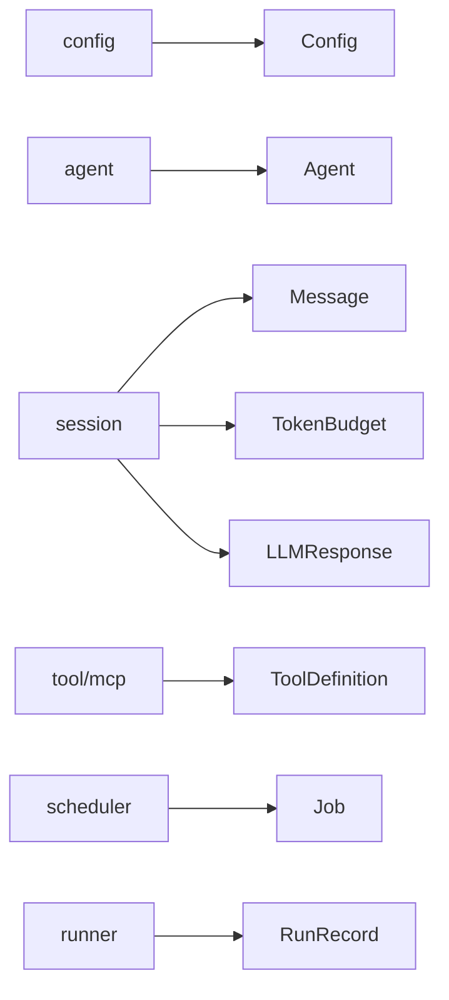

# model

> Shared domain types used across leather's runtime, CLI, and file formats.

## Responsibility

`model` is the foundation of the internal dependency graph. It defines the
structs and enums that other packages exchange, persist, expose through APIs,
or serialize in tool and replay flows. The package intentionally contains no
business logic and imports only the standard library.

## Public API

| Symbol | Signature | Description |
|--------|-----------|-------------|
| `LogLevel` | `type LogLevel string` | Structured logging verbosity enum. |
| `JobStatus` | `type JobStatus string` | Run/scheduler status enum. |
| `ToolDefinition` | `type ToolDefinition struct { ... }` | One callable tool, including HTTP or MCP executor config. |
| `MCPToolConfig` | `type MCPToolConfig struct { ... }` | MCP server name and remote tool name for `mcp` tools. |
| `MCPServerConfig` | `type MCPServerConfig struct { ... }` | Parsed `mcp-servers.yaml` entry. |
| `HTTPToolConfig` | `type HTTPToolConfig struct { ... }` | HTTP method, URL, headers, query, and body templates for a tool. |
| `ToolCall` | `type ToolCall struct { ... }` | Model-requested tool invocation. |
| `ToolResult` | `type ToolResult struct { ... }` | Tool execution result content plus optional error string. |
| `Skill` | `type Skill struct { ... }` | Named tool bundle with prompt append and optional parameters. |
| `Toolset` | `type Toolset struct { ... }` | Named bundle of tool names only, used for exposure policy. |
| `SecretRef` | `type SecretRef struct { ... }` | Pass-store / environment reference for secrets. |
| `NotifyBackendConfig` | `type NotifyBackendConfig struct { ... }` | Telegram or Signal backend configuration. |
| `CacheConfig` | `type CacheConfig struct { ... }` | Per-agent response-cache settings. |
| `OutputRoute` | `type OutputRoute struct { ... }` | Post-run output destination descriptor. |
| `WorkerOutput` | `type WorkerOutput struct { ... }` | Queue destination for worker-collected items. |
| `WorkerDefinition` | `type WorkerDefinition struct { ... }` | Parsed polling-worker definition. |
| `QueueItem` | `type QueueItem struct { ... }` | File-queue payload item. |
| `AgentHooks` | `type AgentHooks struct { ... }` | Optional pre/post shell hooks around agent runs. |
| `Agent` | `type Agent struct { ... }` | Parsed and lifecycle-resolved agent definition. |
| `Job` | `type Job struct { ... }` | Scheduler job record and API payload. |
| `Message` | `type Message struct { ... }` | Session message, including tool-call metadata. |
| `TokenBudget` | `type TokenBudget struct { ... }` | Token ceiling, reserve, and summarization threshold. |
| `LLMResponse` | `type LLMResponse struct { ... }` | Parsed completion result from the LLM client. |
| `Config` | `type Config struct { ... }` | Fully merged runtime configuration. |
| `SessionContext` | `type SessionContext struct { ... }` | Snapshot of a conversation window. |
| `Turn` | `type Turn struct { ... }` | One prompt/response pair stored in a run record. |
| `RunTokens` | `type RunTokens struct { ... }` | Prompt, response, and total token counts for a run. |
| `RunTime` | `type RunTime struct { ... }` | Start timestamp and duration for a run. |
| `RunRecord` | `type RunRecord struct { ... }` | Stored/served result of one completed agent execution. |
| `RunOptions` | `type RunOptions struct { ... }` | Per-invocation options for CLI entrypoints. |
| `LogLevelDebug` | `const LogLevelDebug LogLevel = "debug"` | Debug logging level. |
| `LogLevelInfo` | `const LogLevelInfo LogLevel = "info"` | Info logging level. |
| `LogLevelWarn` | `const LogLevelWarn LogLevel = "warn"` | Warn logging level. |
| `LogLevelError` | `const LogLevelError LogLevel = "error"` | Error logging level. |
| `JobStatusPending` | `const JobStatusPending JobStatus = "pending"` | Pending scheduler state. |
| `JobStatusRunning` | `const JobStatusRunning JobStatus = "running"` | Running scheduler state. |
| `JobStatusSuccess` | `const JobStatusSuccess JobStatus = "success"` | Successful run state. |
| `JobStatusError` | `const JobStatusError JobStatus = "error"` | Failed run state. |
| `JobStatusSkipped` | `const JobStatusSkipped JobStatus = "skipped"` | Skipped scheduler state. |

## Internal Design

The exported types cluster into a few durable groups:

- Agent and scheduling state: `Agent`, `Job`, `JobStatus`, `RunOptions`
- Tooling and integration surfaces: `ToolDefinition`, `MCPToolConfig`,
  `MCPServerConfig`, `Skill`, `Toolset`, `ToolCall`, `ToolResult`
- Session and execution reporting: `Message`, `TokenBudget`, `LLMResponse`,
  `SessionContext`, `Turn`, `RunTokens`, `RunTime`, `RunRecord`
- Config and outputs: `Config`, `CacheConfig`, `OutputRoute`,
  `NotifyBackendConfig`, `SecretRef`, `AgentHooks`, worker and queue types

Most runtime-facing structs carry JSON tags because they are serialized in run
history, APIs, queue files, tool requests, or MCP responses. The package stays
logic-free so other packages can depend on these shapes without introducing
import cycles.

## Dependencies

None. `model` imports only `time` from the standard library.

## Data Flow

## Test Surface

`internal/model` has no direct tests. Its correctness is exercised indirectly
through the packages that parse, transform, persist, and expose these types.

## Related Docs

- [docs/modules/config.md](config.md)
- [docs/modules/agent.md](agent.md)
- [docs/modules/session.md](session.md)
- [docs/modules/tool.md](tool.md)
- [docs/ARCHITECTURE.md](../ARCHITECTURE.md)
