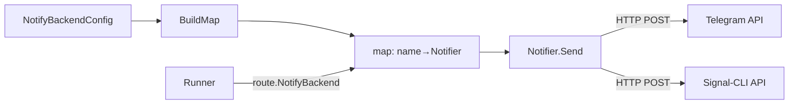

# notify

> Notifier interface, Telegram and Signal messaging backends, and secret resolution.

## Responsibility

`notify` defines how leather sends agent output to external messaging systems.
It owns the `Notifier` interface, the `BuildMap` factory that constructs
configured backend instances from `model.NotifyBackendConfig` values, and the
two built-in backends (Telegram Bot API and Signal-CLI HTTP). Secret
resolution (CLI passthrough → environment variable fallback) is encapsulated
here so no other package handles raw credentials.

## Public API

### Interface

| Symbol | Signature | Description |
|---|---|---|
| `Notifier` | interface | Single-method messaging abstraction. |
| `Notifier.Send` | `(ctx context.Context, msg Message) error` | Deliver `msg` to the backend. Implementations must be safe to call concurrently. |

### Types

| Symbol | Description |
|---|---|
| `Message` | Delivery unit: `AgentName string`, `Content string`, `Tags []string`. |
| `TelegramNotifier` | Backend targeting the Telegram Bot API. Supports group chats and channels. Retries on HTTP 429. Truncates at 4096 bytes (Telegram's hard limit). |
| `SignalNotifier` | Backend targeting a signal-cli REST API server. Supports optional auth header and group messaging. |

### Functions

| Symbol | Signature | Description |
|---|---|---|
| `BuildMap` | `(backends []model.NotifyBackendConfig) (map[string]Notifier, error)` | Construct one `Notifier` per config entry. Returns error if a backend type is unknown or required fields are missing. |

## Internal Design

### Secret resolution (`secret.go`)

`resolve(ctx context.Context, ref model.SecretRef) (string, error)` tries,
in order:

1. **CLI passthrough** — the value is expected to arrive via `ctx.Value(secretCtxKey)` map; this is never used in production (reserved for testing).
2. **Environment variable** — `os.Getenv(ref.Env)` if `ref.Env` is non-empty.
3. Returns empty string with no error if both are absent (optional secrets).

Secret values are **never logged**. Only the env-var name appears in debug output.

### Telegram backend

- Endpoint: `POST https://api.telegram.org/bot<token>/sendMessage`
- Format: `*[AgentName]* content` (MarkdownV2)
- Tags rendered as `#tag` prefix if non-empty
- 429 retry: back off 5 s, retry once
- Content truncated to 4096 UTF-8 bytes (last code-point boundary) before send
- Token resolved via `model.SecretRef` → `resolve()`

### Signal backend

- Endpoint: `POST <baseURL>/v2/send`
- Optional `Authorization` header from `model.SecretRef`
- Supports `recipient` (phone number) or `group_id` (base64 group ID)
- Body serialized as JSON: `{message, recipients: [...]}` or `{message, groupId}`
- Non-2xx responses returned as errors

### `BuildMap` dispatch

```go
switch cfg.Type {
case "telegram":  // build TelegramNotifier
case "signal":    // build SignalNotifier
default:          // return error (fail closed)
}
```

Unknown types fail closed rather than being silently skipped, matching the
leather "fail closed" design rule.

## Dependencies

| Package | Why |
|---|---|
| `internal/model` | `NotifyBackendConfig`, `SecretRef` types |

`internal/notify` has no other intra-project imports. It is a leaf package.

## Data Flow



## Test Surface

`internal/notify/notify_test.go` — 20 tests using `httptest.NewServer`:
- `BuildMap`: unknown type rejected, empty config returns empty map
- `TelegramNotifier.Send`: success path, 429 retry, content truncation
- `SignalNotifier.Send`: recipient path, group_id path, auth header, non-2xx error
- `formatTelegram`: tag rendering, no-tag rendering
- `formatSignal`: message formatting
- Secret resolution: env var hit, env var missing → empty string, unknown ctx key

## Related Docs

- [docs/modules/runner.md](runner.md) — issues `Notifier.Send` via output routing
- [docs/ARCHITECTURE.md](../ARCHITECTURE.md) — notify in the output routing table
