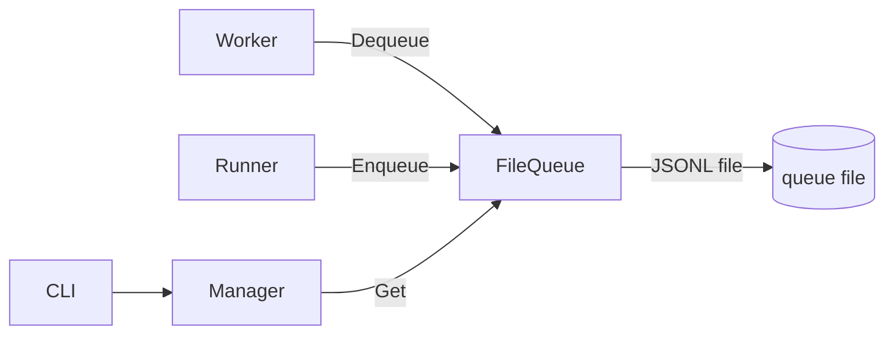

# queue

> JSONL file-backed FIFO queue and named queue manager.

## Responsibility

`queue` provides a simple, durable message queue backed by append-only JSONL
files. A `FileQueue` is a named FIFO; a `Manager` provides a shared registry
of queues by name, creating them lazily on first access. Other packages
(runner for output routing, worker for payload ingestion) use `Manager` to
share queue state without coupling directly to each other.

## Public API

### Types

| Symbol | Description |
|---|---|
| `FileQueue` | Append-only JSONL queue backed by a single file on disk. Thread-safe via a per-queue mutex. |
| `Manager` | Named registry of `FileQueue` instances. Creates queues lazily. Thread-safe via a global mutex. |

### FileQueue functions

| Symbol | Signature | Description |
|---|---|---|
| `NewFileQueue` | `(path string) (*FileQueue, error)` | Open (or create) the queue file at `path`. Reads existing entries on open to compute `size`. |
| `(*FileQueue).Enqueue` | `(item model.QueueItem) error` | Append `item` as a JSON line. Returns error if marshaling or write fails. |
| `(*FileQueue).Dequeue` | `() (model.QueueItem, bool, error)` | Remove and return the oldest item. Returns `(zero, false, nil)` if queue is empty. |
| `(*FileQueue).Peek` | `() (model.QueueItem, bool, error)` | Return oldest item without removing it. |
| `(*FileQueue).Len` | `() int` | Current number of unread items (approximate; best-effort without a full scan). |
| `(*FileQueue).Flush` | `() error` | Rewrite the file keeping only unconsumed items. Compact operation. |

### Manager functions

| Symbol | Signature | Description |
|---|---|---|
| `NewManager` | `(dir string) (*Manager, error)` | Initialize manager rooted at `dir`. Creates `dir` if absent. |
| `(*Manager).Get` | `(name string) (*FileQueue, error)` | Return the named queue, creating it if it does not exist. |
| `(*Manager).Names` | `() []string` | Sorted list of queue names known to this manager. |

## Internal Design

### File format

Each `Enqueue` appends one UTF-8 JSON line (`json.Marshal(item) + "\n"`).
`Dequeue` reads the first unconsumed line, advances an internal offset, and
returns the parsed item. File compaction (`Flush`) rewrites the file with
only the unconsumed tail.

### Durability contract

Queue files survive process restarts. On `NewFileQueue`, all existing lines
are scanned to compute the initial unconsumed offset. Partially written lines
(caused by a crash mid-write) are skipped and logged as `warn`.

### Concurrency

Each `FileQueue` holds a `sync.Mutex` protecting all file operations. `Manager`
holds a separate `sync.Mutex` for the name map. Callers may call `Get` from
multiple goroutines safely.

### Queue item format

`model.QueueItem` is defined in `internal/model/model.go`:
```
QueueItem {
    ID        string
    QueueName string
    Payload   map[string]any
    EnqueuedAt int64  // Unix timestamp
}
```

## Dependencies

| Package | Why |
|---|---|
| `internal/model` | `QueueItem` type |

`internal/queue` has no other intra-project imports.

## Data Flow



## Test Surface

`internal/queue/queue_test.go`:
- Enqueue + Dequeue round-trip: single item, multiple items, FIFO order
- Empty queue: Dequeue returns false
- Concurrent Enqueue from multiple goroutines
- Restart recovery: re-open queue, unconsumed items still present
- Flush compaction: file shrinks after flush
- Manager.Get: same name → same FileQueue instance
- Manager.Names: sorted order

## Related Docs

- [docs/modules/runner.md](runner.md) — enqueues via `queue` output route
- [docs/modules/worker.md](worker.md) — dequeues to feed agent prompt payloads
- [docs/ARCHITECTURE.md](../ARCHITECTURE.md) — queue in the worker→runner pipeline
