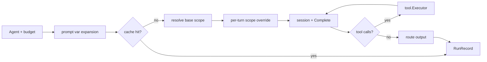

# runner

> Agent execution loop with prompt expansion, turn-scoped tool exposure, caching, and output routing.

## Responsibility

`runner` owns the runtime path from a resolved `model.Agent` to a completed
`model.RunRecord`. It builds the session, applies prompt variables, resolves
skill and toolset scope, executes multi-round tool calls, records progress, and
fans the final content out to file, queue, HTTP, and notify destinations. The
CLI wires `Runner` once and reuses it for `serve`, `run`, and test-oriented
paths.

## Public API

| Symbol | Signature | Description |
|--------|-----------|-------------|
| `DefaultToolRounds` | `const DefaultToolRounds = 5` | Fallback tool-round cap when neither config nor agent overrides it. |
| `Runner` | `type Runner struct { ... }` | Runtime executor. Fields: `Client`, `Registry`, `Log`, `MaxToolRounds`, `Cache`, `QueueMgr`, `Notifiers`, `MCPRegistry`, `HideBuffer`, `ProgressFn`, `DebugContextFn`, `ForceTextAfterHide`, `NoToolsForFirstTurn`, `NoToolsForLastTurn`, `Vars`. |
| `ProgressEvent` | `type ProgressEvent struct { ... }` | Event emitted during prompt and tool activity. Consumed by the pretty-mode CLI and the devtools bus. |
| `ContextSnapshot` | `type ContextSnapshot struct { ... }` | Point-in-time view of the exact input sent to one LLM completion call (`AgentName`, `Turn`, `Round`, `Messages`, etc.). Delivered to `Runner.DebugContextFn` immediately before each `client.Complete` call. |
| `(*Runner).Run` | `func (r *Runner) Run(ctx context.Context, a model.Agent, budget model.TokenBudget) (model.RunRecord, error)` | Execute one agent run, including tools, cache, hooks, and output routes. |
| `BuildRunData` | `func BuildRunData(a model.Agent) map[string]any` | Build standard prompt-template variables: `agent_name`, `schedule`, `now`, `tags`. Merged with `Runner.Vars` per turn. |
| `ExpandPromptPayload` | `func ExpandPromptPayload(a model.Agent, payload map[string]any) (model.Agent, error)` | Apply `text/template` substitution to prompt text from queue payloads. |

### Hide-related Runner fields

The runner is the integration point for buffered hides:

- `HideBuffer *hide.HideBuffer` — when non-nil, oversized tool outputs are intercepted and paged through `hide_next` / `hide_jump` / `hide_search` tools instead of being delivered in full.
- `ForceTextAfterHide bool` — after a hide-navigation tool fires within a round, strip all tools from the next call so the model is forced to emit text rather than chain another paging call.
- `NoToolsForFirstTurn bool` — suppress all tools on user-turn 0; pairs with `ForceTextAfterHide` for "reflect on the first page" workflows.
- `NoToolsForLastTurn bool` — suppress all tools on the final user turn so the closing structured output is plain text.

## Internal Design

`Run` starts by firing the agent's lifecycle hooks, building the base tool
scope from `a.Skills` and `a.Toolsets`, and appending prompt text from active
skills. When `Runner.Vars` is populated, both `{{key}}` and `{{.key}}`
placeholders are substituted into the system prompt and every user prompt
before the first LLM call.

Caching happens before model execution once prompt augmentation is resolved. If
there is a cache hit, the runner returns a synthetic success `RunRecord`
immediately.

Turn execution is scope-aware. A base tool scope comes from the agent-level
skill and toolset lists, but any turn that declares `TurnSkills`,
`TurnToolsets`, or `TurnTools` replaces that base scope for that turn only.
Tool calls are validated against the current scope, then executed through
`tool.Executor`, which can reach either HTTP or MCP tools.

Output routing is intentionally non-fatal. `file` writes use 0600 permissions,
`queue` routes enqueue `model.QueueItem` values, `http` routes send plain text
with configurable method and headers, and `notify` routes deliver
`notify.Message` payloads through named backends. One failed route does not
prevent the others from running.

## Dependencies

| Package | Why |
|---|---|
| `internal/session` | Session management and the LLM client interface. |
| `internal/tool` | Tool lookup and HTTP/MCP execution. |
| `internal/mcp` | Registry of started MCP clients passed through to `tool.Executor`. |
| `internal/cache` | Pre-run cache lookup and post-run cache write. |
| `internal/queue` | Queue input expansion and queue output routes. |
| `internal/notify` | Notify output routing. |
| `internal/hide` | Buffered-hide store and pagination for oversized tool output. |
| `internal/model` | Agent, run, token, route, and queue types. |
| `internal/logging` | Structured runtime logging. |

## Data Flow

## Test Surface

`internal/runner/runner_test.go` covers no-tool runs, LLM failures, multi-round
tool loops, unknown tool rejection, round-cap failures, turn skill/toolset/tool
scope replacement, prompt payload substitution, and route-output behavior using
mock notifiers, temp files, and queue managers.

## Related Docs

- [docs/modules/tool.md](tool.md)
- [docs/modules/mcp.md](mcp.md)
- [docs/modules/cache.md](cache.md)
- [docs/modules/notify.md](notify.md)
- [docs/ARCHITECTURE.md](../ARCHITECTURE.md)
