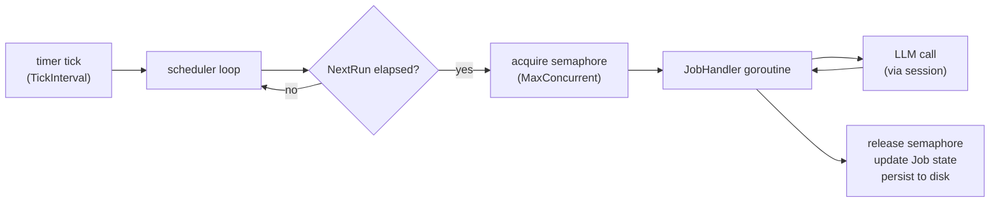

# scheduler

> Cron expression parsing, job queue, bounded execution pool, and job state persistence.

## Responsibility

`scheduler` owns the periodic execution of agents. It parses cron expressions,
maintains a job registry, fires handlers when their scheduled time arrives, and
enforces a concurrency ceiling. Job state (last run, next run, status, error)
is persisted to disk after each execution so `leather status` can show history
across restarts.

## Public API

### Types

| Symbol | Description |
|---|---|
| `JobHandler` | `func(ctx context.Context, job model.Job) error` — function signature invoked on each trigger. |
| `Options` | Scheduler configuration: `MaxConcurrent int`, `StateDir string`, `TickInterval time.Duration`. |
| `Scheduler` | Drives periodic agent execution. |
| `Schedule` | Parsed cron expression; computes future trigger times. |

### Scheduler functions

| Symbol | Signature | Description |
|---|---|---|
| `New` | `(opts Options) *Scheduler` | Create a Scheduler with the given options. |
| `(*Scheduler).Register` | `(name, scheduleExpr string, handler JobHandler) error` | Add a job. Returns an error if the expression is invalid or the name is already registered. |
| `(*Scheduler).Start` | `(ctx context.Context) error` | Run the scheduler loop until ctx is cancelled. Blocks; call in a goroutine. |
| `(*Scheduler).Drain` | `(timeout time.Duration) error` | Wait for all in-flight handlers to complete, up to timeout. Used during graceful shutdown. |
| `(*Scheduler).Jobs` | `() []model.Job` | Snapshot of all job records, safe for concurrent reads. |

### Schedule (cron) functions

| Symbol | Signature | Description |
|---|---|---|
| `ParseSchedule` | `(expr string) (*Schedule, error)` | Parse a five- or six-field cron expression or the special value `"once"`. |
| `(*Schedule).Once` | `() bool` | True if the schedule fires only once. |
| `(*Schedule).HasSeconds` | `() bool` | True if a six-field (second-granularity) expression was parsed. |
| `(*Schedule).Next` | `(from time.Time) time.Time` | Next trigger time strictly after `from`. |

### State functions

| Symbol | Signature | Description |
|---|---|---|
| `LoadState` | `(dir string) ([]model.Job, error)` | Read persisted job records from `dir/jobs.json`. |

## Internal Design

**Cron format:** Supports standard five-field (`min hour dom month dow`) and
six-field (`sec min hour dom month dow`) expressions. Implemented without
external libraries using a bitmask-based field matcher (`cron.go`).

**Tick loop:** `Start` wakes on `opts.TickInterval` (default 1 minute),
iterates all registered jobs, and dispatches any whose `NextRun` has elapsed.
Each dispatch increments a `sync.WaitGroup` counter and runs the `JobHandler`
in a goroutine. A semaphore channel (`chan struct{}` of capacity
`MaxConcurrent`) blocks new dispatches when the concurrency ceiling is reached.

**`"once"` schedule:** A job with `Schedule: "once"` fires exactly once on
first evaluation and is then skipped on all future ticks.

**State persistence:** After each handler returns, the scheduler writes
`dir/jobs.json` with all job records (status, timestamps, error, run count).
File permissions are 0600. Reads at startup to restore history.

**Graceful shutdown:** `cli.RunServe` cancels the scheduler's context on
SIGINT/SIGTERM, then calls `Drain` with a timeout before exiting. This ensures
in-flight LLM calls complete cleanly.

## Dependencies

- `internal/model` — `Job`, `JobStatus`

## Data Flow

## Test Surface

- `scheduler_test.go` — tests `Register`, `Start`/`Drain`, concurrency
  bounding, `"once"` schedule, job state updates.
- `cron_test.go` — table-driven tests for `ParseSchedule` (valid/invalid
  expressions), `(*Schedule).Next` (at-boundary cases, DST transitions),
  `HasSeconds`.
- `state_test.go` — tests `LoadState` / save round-trip, missing directory
  handling, JSON corruption handling. Uses `t.TempDir()`.

## Related Docs

- [docs/modules/model.md](model.md) — `Job`, `JobStatus`
- [docs/modules/cli.md](cli.md) — `RunServe` builds and drives the Scheduler
- [docs/ARCHITECTURE.md](../ARCHITECTURE.md)
