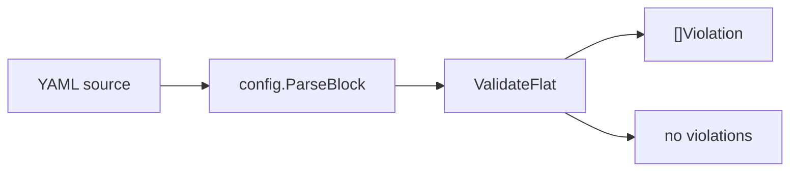

# schema

> Flat-schema validation for config, agent, skill, worker, curing, tannery,
> toolset, and MCP definition files.

## Responsibility

`schema` provides lightweight validation for the flat scalar and list portions
of leather definition files. It catches missing required fields, bad enums,
invalid durations, malformed cron expressions, and similar shape errors before
the deeper package-specific parsers run. Nested blocks remain owned by the
package that actually interprets them; `schema` is intentionally shallow.

## Public API

| Symbol | Signature | Description |
|--------|-----------|-------------|
| `FieldType` | `type FieldType uint8` | Enum describing the expected scalar format for one YAML field. Values: `TypeString` (any non-empty string), `TypeInteger`, `TypeNumber`, `TypeBoolean` (`true`/`false`, case-insensitive), `TypeDuration` (a `time.ParseDuration` string), `TypeCron` (5-field expression or `once`), `TypeEnum` (one of `Field.AllowedValues`). |
| `Field` | `type Field struct { ... }` | Validation rule for one field, including required/list/enum/range metadata. |
| `Schema` | `type Schema map[string]Field` | Flat schema definition for one file type. |
| `Violation` | `type Violation struct { Field string; Line int; Message string }` | One validation failure. `Line` is 1-indexed; `0` means unknown (e.g. `ParseBlock` callers). |
| `ValidateFlat` | `func ValidateFlat(vals map[string]string, lists map[string][]string, lines map[string]int, s Schema) []Violation` | Apply a flat schema to already-parsed scalar and list maps. `lines` carries per-field source lines for `Violation.Line`; pass nil when unavailable. |
| `ValidateAgentFrontmatter` | `func ValidateAgentFrontmatter(src string) []Violation` | Validate the YAML block from `*.agent.md` front matter. |
| `ValidateLifecycleYAML` | `func ValidateLifecycleYAML(src string) []Violation` | Validate flat lifecycle fields. |
| `ValidateConfigYAML` | `func ValidateConfigYAML(src string) []Violation` | Validate flat `config.yaml` fields. |
| `ValidateSkillYAML` | `func ValidateSkillYAML(src string) []Violation` | Validate top-level skill metadata. |
| `ValidateWorkerYAML` | `func ValidateWorkerYAML(src string) []Violation` | Validate worker scalar fields. |
| `ValidateMCPServersYAML` | `func ValidateMCPServersYAML(src string) []Violation` | Validate each `servers:` item in `mcp-servers.yaml`. |
| `ValidateTanneryYAML` | `func ValidateTanneryYAML(src string) []Violation` | Validate `tannery.yaml`: top-level fields plus each `routes:`, `queues:`, and `webhooks:` item. |
| `ValidateCuringYAML` | `func ValidateCuringYAML(src string) []Violation` | Validate flat `*.curing.yaml` fields and the `output:` block. |
| `ValidateToolsetYAML` | `func ValidateToolsetYAML(src string) []Violation` | Validate toolset definition fields. |
| `ValidateShellToolsJSON` | `func ValidateShellToolsJSON(src string) []Violation` | Validate the `shell-tools.json` tool schema consumed by `cmd/shell-mcp`. |

### Exported schemas

The static `Schema` values in `defs.go` are exported so callers can validate
pre-parsed maps directly via `ValidateFlat` instead of re-tokenizing a source
string: `AgentFrontmatterSchema`, `ConfigSchema`, `CuringSchema`,
`CuringOutputSchema`, `LifecycleSchema`, `MCPServersItemSchema`, `SkillSchema`,
`TanneryConfigSchema`, `TanneryQueueSchema`, `TanneryRouteSchema`,
`TanneryWebhookSchema`, `ToolsetSchema`, `WorkerSchema`.

## Internal Design

`schema` delegates YAML tokenization to `config.ParseBlock`, then validates the
resulting scalar and list maps with `ValidateFlat`. That keeps the package
stdlib-only while avoiding a second YAML parser implementation.

Each file type has a static schema in `defs.go`. These schemas intentionally
cover only the flat surface. Nested sections such as `cache:`, `output:`,
`hooks:`, `parameters:`, and worker output blocks are left to the owning
package parsers.

`TypeCron` validation uses a lazily compiled regex guarded by `sync.Once` and
accepts five- or six-field cron expressions plus the special `once` value.
`ValidateMCPServersYAML` uses a dedicated splitter because `mcp-servers.yaml`
is a list of flat objects rather than a single flat map. `ValidateTanneryYAML`
does the same for its three list sections, validating each item against
`TanneryRouteSchema`, `TanneryQueueSchema`, or `TanneryWebhookSchema` after the
top-level fields pass `TanneryConfigSchema`. `ValidateShellToolsJSON` is the one
validator with a non-YAML input; it reads the JSON tool schema that
`cmd/shell-mcp` serves.

## Dependencies

| Package | Why |
|---|---|
| `internal/config` | Reuses `ParseBlock` for flat YAML extraction. |

## Data Flow

## Test Surface

`internal/schema/schema_test.go` covers required-field checks, list-required
fields, scalar type validation, integer bounds, cron handling, wrapper
validators for agent/lifecycle/skill/worker documents, and optional-field
absence semantics.

## Related Docs

- [docs/modules/config.md](config.md)
- [docs/modules/agent.md](agent.md)
- [docs/modules/cli.md](cli.md)
- [docs/ARCHITECTURE.md](../ARCHITECTURE.md)