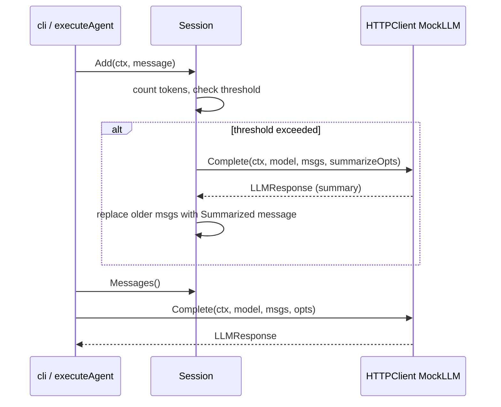

# session

> Token budget tracking, context window management, and LLM client abstraction.

## Responsibility

`session` owns everything between "I have a list of messages" and "I get back
a model response." It tracks token budgets, accumulates conversational turns,
triggers automatic summarization when the context window fills, and defines
the `LLMClient` interface that decouples leather from any specific LLM backend.
It also provides `HTTPClient` (the production implementation) and `MockLLM`
(the test double).

## Public API

### Interface

| Symbol | Signature | Description |
|---|---|---|
| `LLMClient` | interface | The boundary between leather and a model backend. Two methods: `Complete` and `CountTokens`. |
| `LLMClient.Complete` | `(ctx, modelName string, messages []model.Message, opts CompletionOptions) (model.LLMResponse, error)` | Send a chat completion request. |
| `LLMClient.CountTokens` | `(messages []model.Message) (int, error)` | Estimate token count for a message list. |

### Types

| Symbol | Description |
|---|---|
| `CompletionOptions` | Per-call settings: `MaxTokens int`, `Temperature float64`, `ExtraBody map[string]any` (merged verbatim into request body). |
| `Session` | Manages the context window: accumulates messages, tracks token counts, triggers summarization. |
| `HTTPClient` | Production `LLMClient` targeting an OpenAI-compatible endpoint. |
| `MockLLM` | Deterministic test double. Returns configured response, records all calls. |
| `MockConfig` | Configuration for `MockLLM`: `Response string`, `TokensPerMessage int`, `Err error`. |

### Session functions

| Symbol | Signature | Description |
|---|---|---|
| `New` | `(budget model.TokenBudget, modelName string, client LLMClient) *Session` | Create a new session with the given budget, model, and client. |
| `(*Session).Add` | `(ctx context.Context, msg model.Message) error` | Append a message, count tokens, trigger summarization if threshold is exceeded. |
| `(*Session).Messages` | `() []model.Message` | Return a copy of the current message list. |
| `(*Session).Usage` | `() (used, remaining int)` | Current token usage and remaining capacity. |
| `(*Session).Snapshot` | `(metadata map[string]string) model.SessionContext` | Point-in-time snapshot of the context window. |
| `(*Session).Reset` | `()` | Clear the context window; preserve the system prompt if present as first message. |

### HTTPClient functions

| Symbol | Signature | Description |
|---|---|---|
| `NewHTTPClient` | `(endpoint, apiKey string, timeout time.Duration) *HTTPClient` | Create an HTTPClient targeting the given base URL. When `apiKey` is non-empty it is sent on every request as `Authorization: Bearer <apiKey>`. The key is never logged. Pass `""` for unauthenticated local endpoints (e.g. local vLLM). |
| `(*HTTPClient).Complete` | `(ctx, modelName, messages, opts) (model.LLMResponse, error)` | POST to `<endpoint>/v1/chat/completions`. Merges `opts.ExtraBody` into the request body. |
| `(*HTTPClient).CountTokens` | `(messages []model.Message) (int, error)` | Character-based heuristic: ~4 chars/token. |

### MockLLM functions

| Symbol | Signature | Description |
|---|---|---|
| `NewMockLLM` | `(cfg MockConfig) *MockLLM` | Create a MockLLM with the given configuration. |
| `(*MockLLM).Complete` | `(ctx, modelName, messages, opts) (model.LLMResponse, error)` | Record the call; return `cfg.Response` or `cfg.Err`. |
| `(*MockLLM).CountTokens` | `(messages) (int, error)` | Return `cfg.TokensPerMessage * len(messages)`. |
| `(*MockLLM).Calls` | `() [][]model.Message` | All message lists received by `Complete`. |
| `(*MockLLM).CallCount` | `() int` | Number of `Complete` calls received. |

## Internal Design

**Token counting:** `CountTokens` uses a character-based heuristic (~4 chars
per token) rather than a real tokenizer, keeping the implementation
stdlib-only. Estimates are sufficient for budget enforcement; exact counts are
not required.

**Summarization trigger:** When `Add` causes `usedTokens` to exceed
`budget.MaxTokens * budget.SummarizeThreshold`, the session calls
`client.Complete` with a summarization prompt to condense earlier turns into a
single `Summarized: true` message. The system prompt (role `"system"`) is
always preserved.

**`ExtraBody`:** `CompletionOptions.ExtraBody` is a `map[string]any` whose
keys are merged into the top-level JSON request body verbatim. This allows
callers to pass model-specific parameters (e.g. `chat_template_kwargs`) without
requiring changes to the core API.

**Thread safety:** `Session` is not safe for concurrent use from multiple
goroutines. Each agent execution creates its own `Session`.

## Dependencies

- `internal/model` — `Message`, `TokenBudget`, `LLMResponse`, `SessionContext`

## Data Flow

## Test Surface

- `session_test.go` — tests `Add`, token budget enforcement, summarization
  trigger, `Reset` (system prompt preservation), `Snapshot`, `Usage`.
  All tests use `MockLLM`.

## Related Docs

- [docs/modules/model.md](model.md) — `Message`, `TokenBudget`, `LLMResponse`
- [docs/modules/cli.md](cli.md) — calls `session.New` and `session.CompletionOptions`
- [docs/ARCHITECTURE.md](../ARCHITECTURE.md)
