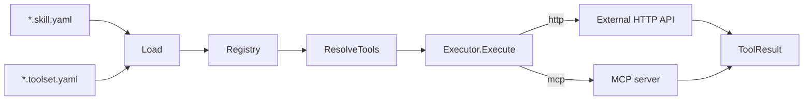

# tool

> Skill and toolset loading plus HTTP and MCP tool execution.

## Responsibility

`tool` owns leather's tool registry and execution adapter layer. It loads
`*.skill.yaml` and `*.toolset.yaml` files, validates that tool names are unique
and that toolsets reference real tools, and executes individual tool calls via
HTTP or MCP. It is the package that turns named tool policy into executable
definitions for the runner.

## Public API

| Symbol | Signature | Description |
|--------|-----------|-------------|
| `Registry` | `type Registry struct { ... }` | In-memory store of skills, tools, and toolsets. |
| `Executor` | `type Executor struct { MCP *mcp.Registry }` | Tool executor that dispatches HTTP and MCP tools. |
| `NewRegistry` | `func NewRegistry() *Registry` | Return an empty registry. |
| `Load` | `func Load(dir string) (*Registry, error)` | Read `*.skill.yaml` and `*.toolset.yaml` files from a directory. |
| `(*Registry).Register` | `func (r *Registry) Register(s model.Skill) error` | Add one skill and index its tool definitions. |
| `(*Registry).RegisterToolset` | `func (r *Registry) RegisterToolset(s model.Toolset) error` | Add one named toolset after validating referenced tools. |
| `(*Registry).GetTool` | `func (r *Registry) GetTool(name string) (model.ToolDefinition, bool)` | Exact lookup by tool name. |
| `(*Registry).GetToolset` | `func (r *Registry) GetToolset(name string) (model.Toolset, bool)` | Exact lookup by toolset name. |
| `(*Registry).GetTools` | `func (r *Registry) GetTools(skillNames []string) []model.ToolDefinition` | Ordered, deduplicated union of tools exposed by skills. |
| `(*Registry).GetToolsetTools` | `func (r *Registry) GetToolsetTools(toolsetNames []string) []model.ToolDefinition` | Ordered, deduplicated union of tools exposed by toolsets. |
| `(*Registry).ResolveTools` | `func (r *Registry) ResolveTools(skillNames, toolsetNames, toolNames []string) []model.ToolDefinition` | Resolve tool exposure from skills, then toolsets, then explicit names. |
| `(*Registry).GetSkills` | `func (r *Registry) GetSkills(skillNames []string) []model.Skill` | Return full skill values, including prompt appends and parameters. |
| `(*Executor).Execute` | `func (e *Executor) Execute(ctx context.Context, def model.ToolDefinition, args map[string]any) model.ToolResult` | Execute one tool call and return content or error text. |
| `Execute` | `func Execute(ctx context.Context, def model.ToolDefinition, args map[string]any) model.ToolResult` | Backward-compatible helper for HTTP-only execution. |

## Internal Design

`Load` does a two-pass directory load. Skill files register first so every tool
definition is known; toolset files are buffered and validated in a second pass.
That prevents a toolset from referencing a tool that has not yet been loaded.

`parseSkillYAML` and `parseToolsetYAML` are small line-oriented parsers that
cover the subset of YAML leather needs. Skills can define prompt append text,
optional parameters, and nested tool config. Toolsets are intentionally simpler:
name, description, and an ordered list of tool names.

`Executor.Execute` dispatches by `ToolDefinition.Type`. HTTP tools go through
`execHTTP`, which expands `{{.arg}}` and `{{env:VAR}}` templates, appends query
params, serializes JSON bodies, caps responses at 1 MB, and retries exactly
once on rate-limit responses. MCP tools go through `execMCP`, which looks up a
started server in `mcp.Registry` and calls the named remote tool.

When a tool definition sets `OutputFile`, successful execution writes the raw
result to disk best-effort without failing the tool call if the write fails.

## Dependencies

| Package | Why |
|---|---|
| `internal/mcp` | Execute `mcp`-type tools through started MCP clients. |
| `internal/model` | Shared skill, toolset, and tool definition types. |

## Data Flow

## Test Surface

`internal/tool/registry_test.go` covers skill parsing, toolset parsing,
duplicate-tool rejection, directory loading, skill retrieval, toolset
resolution, and template expansion behavior. `internal/tool/executor_test.go`
covers HTTP success and failure paths, request-body/query expansion, rate-limit
retry behavior, unsupported tool types, and context cancellation during retry
waits.

## Related Docs

- [docs/modules/mcp.md](mcp.md)
- [docs/modules/runner.md](runner.md)
- [docs/ARCHITECTURE.md](../ARCHITECTURE.md)
