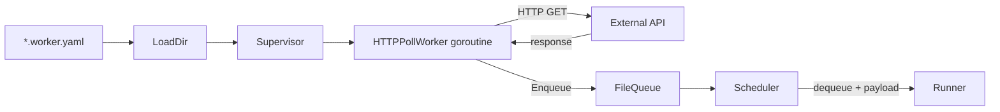

# worker

> Declarative HTTP poll workers and Supervisor lifecycle management.

## Responsibility

`worker` polls external HTTP endpoints on a configurable interval, writes
responses into named queues, and manages the lifecycles of all workers through
a `Supervisor`. Workers are defined in `*.worker.yaml` files; `LoadDir` reads
and validates them at startup. The `Supervisor` starts each worker in its own
goroutine and coordinates clean shutdown via context cancellation.

Worker data flows into queues, from which the scheduler can trigger agent runs
with the fetched payload as template variables.

## Public API

### Types

| Symbol | Description |
|---|---|
| `HTTPPollWorker` | Polls a URL at a fixed interval, parses the response, and enqueues the result as a `QueueItem`. |
| `Supervisor` | Manages the lifecycle of all loaded `HTTPPollWorker` instances. Starts goroutines and stops them cleanly. |

### Functions

| Symbol | Signature | Description |
|---|---|---|
| `LoadDir` | `(dir string) ([]model.WorkerDefinition, error)` | Read all `*.worker.yaml` files in `dir`. Returns parsed definitions. Returns error for any invalid file. |
| `NewSupervisor` | `(defs []model.WorkerDefinition, qm *queue.Manager, log *logging.Logger) (*Supervisor, error)` | Create a supervisor and instantiate one `HTTPPollWorker` per definition. |
| `(*Supervisor).Start` | `(ctx context.Context)` | Launch each worker's poll loop in a goroutine. Returns immediately. |
| `(*Supervisor).Stop` | `()` | Signal all workers to stop and wait for their goroutines to exit. |

## Internal Design

### Worker YAML format (`*.worker.yaml`)

```yaml
name: my-worker          # required; unique identifier
url: https://api/v1/data # required; HTTP endpoint to poll
method: GET              # optional; default GET
interval: 30s            # required; polling interval (Go duration string)
queue: my-queue          # required; target queue name
headers:                 # optional; key: value pairs
  Authorization: "Bearer {{env:API_TOKEN}}"
response_field: items    # optional; extract a JSON field from the response body
```

Header values support `{{env:VAR}}` expansion (same as tool headers).

### Poll loop

Each `HTTPPollWorker` runs a loop:
1. Wait for next tick (ticker channel or context cancellation).
2. Make the HTTP request with the caller's context.
3. Parse response body as JSON if `response_field` is set; extract field.
4. Build a `model.QueueItem{Payload: parsedPayload}`.
5. Call `Manager.Get(queue).Enqueue(item)`.
6. Log success or warn on any error; never panic.

Errors during a single poll are non-fatal: the worker logs `warn` and retries
on the next tick.

### Supervisor shutdown

`Stop` calls `context.Cancel` on the supervisor-owned context and then waits
on a `sync.WaitGroup` for all goroutines to return. Goroutines check the
context's `Done` channel inside the ticker select.

### Worker definition model

`model.WorkerDefinition`:
```
WorkerDefinition {
    Name          string
    URL           string
    Method        string        // default: "GET"
    Interval      time.Duration
    Queue         string
    Headers       map[string]string
    ResponseField string
}
```

## Dependencies

| Package | Why |
|---|---|
| `internal/queue` | Enqueue fetched payload items |
| `internal/model` | `WorkerDefinition`, `WorkerOutput`, `QueueItem` types |
| `internal/logging` | Structured log output |

`internal/worker` does not import `internal/runner` or `internal/scheduler`.
Data flows through the queue, not through direct function calls.

## Data Flow



## Test Surface

`internal/worker/worker_test.go` using `httptest.NewServer`:
- `LoadDir`: parses single and multiple worker files, rejects invalid YAML
- Poll loop: item enqueued after first tick
- Poll loop error: HTTP 500 → warn logged, no enqueue, loop continues
- Context cancel: goroutine exits cleanly
- `ResponseField` extraction: nested JSON field extracted correctly
- Supervisor start/stop: all workers started, all stopped, no goroutine leak

## Related Docs

- [docs/modules/queue.md](queue.md) — queue that workers write into
- [docs/modules/scheduler.md](../modules/scheduler.md) — triggers agent runs on queue data
- [docs/ARCHITECTURE.md](../ARCHITECTURE.md) — worker→queue→runner pipeline
