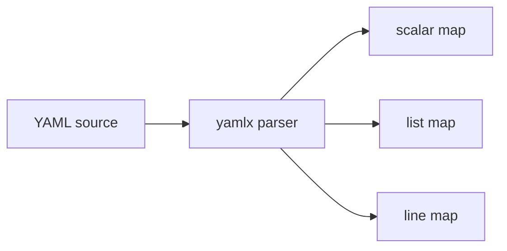

# yamlx

> Stdlib-only parser for leather's small flat subset of YAML.

## Responsibility

`yamlx` is the shared parser for the intentionally small YAML surface leather
supports in config files, agent front matter, lifecycle files, and worker
definitions. It handles flat key/value pairs plus flow-style and block-style
lists without pulling in a third-party YAML dependency.

## Public API

| Symbol | Signature | Description |
|---|---|---|
| `ParseBlock` | `func ParseBlock(src string) (map[string]string, map[string][]string)` | Parse one flat YAML block from a string into scalar and list maps. |
| `ParseFlat` | `func ParseFlat(r io.Reader) (vals map[string]string, lists map[string][]string, err error)` | Parse a flat YAML document from an `io.Reader`. |
| `ParseFlatLines` | `func ParseFlatLines(r io.Reader) (vals map[string]string, lists map[string][]string, lines map[string]int, err error)` | Parse flat YAML and track 1-indexed source lines for scalar keys. |
| `SplitKV` | `func SplitKV(line string) (key, value string, ok bool)` | Split one `key: value` line and strip inline comments and quotes. |
| `StripQuotes` | `func StripQuotes(s string) string` | Remove one matching pair of surrounding single or double quotes. |

## Internal Design

The parser is intentionally not general YAML. It supports the subset leather
actually uses:

- scalar `key: value` pairs
- flow lists like `key: [a, b]`
- block lists like `key:` followed by `- item` lines
- comment stripping and surrounding quote stripping

Nested maps, anchors, aliases, and multi-document semantics remain out of
scope. That tradeoff keeps the project stdlib-only while still letting config,
schema, agent, and worker loaders share one parser rather than drifting into
slightly different ad hoc implementations.

`ParseFlatLines` exists for callers that need better validation or error
reporting with source line numbers, while `SplitKV` and `StripQuotes` support
smaller parser helpers elsewhere in the repo.

## Dependencies

Stdlib only.

## Data Flow

## Test Surface

`internal/yamlx/yamlx_test.go` covers scalar parsing, flow-style lists,
block-style lists, quote stripping, inline comments, and line-number tracking.

## Related Docs

- [docs/modules/config.md](config.md)
- [docs/modules/agent.md](agent.md)
- [docs/modules/schema.md](schema.md)
- [docs/modules/worker.md](worker.md)
- [docs/ARCHITECTURE.md](../ARCHITECTURE.md)
